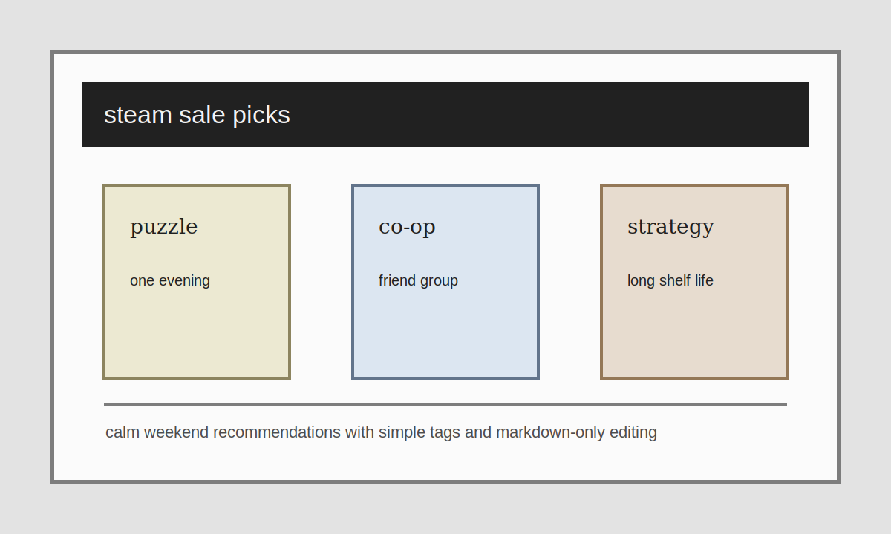

This is the matching game-side Markdown example. It keeps the same frontmatter rules but changes only the `section` and the tags.

## Three lightweight picks

### 1. A short puzzle game

Great when you want one evening of clean, focused play with almost no setup time.

### 2. A co-op action game

Better for a friend group that wants something noisy, slightly messy, and easy to laugh about.

### 3. A slower strategy game

Useful when the sale is good and you want something that can sit on your machine for months before you fully dive in.

## Why Markdown still works here

Recommendation posts rarely need custom structure. A short intro, a few headings, a pull quote, and some tags are usually enough.

> Use Markdown first. Reach for MDX only when the article clearly benefits from reusable components.

## Tagging idea

Use tags for the smaller topic axis: `co-op`, `roguelike`, `steam-sale`, `deck-builder`, `boss-rush`, and so on. That keeps the archive flexible without turning navigation into a mess.
