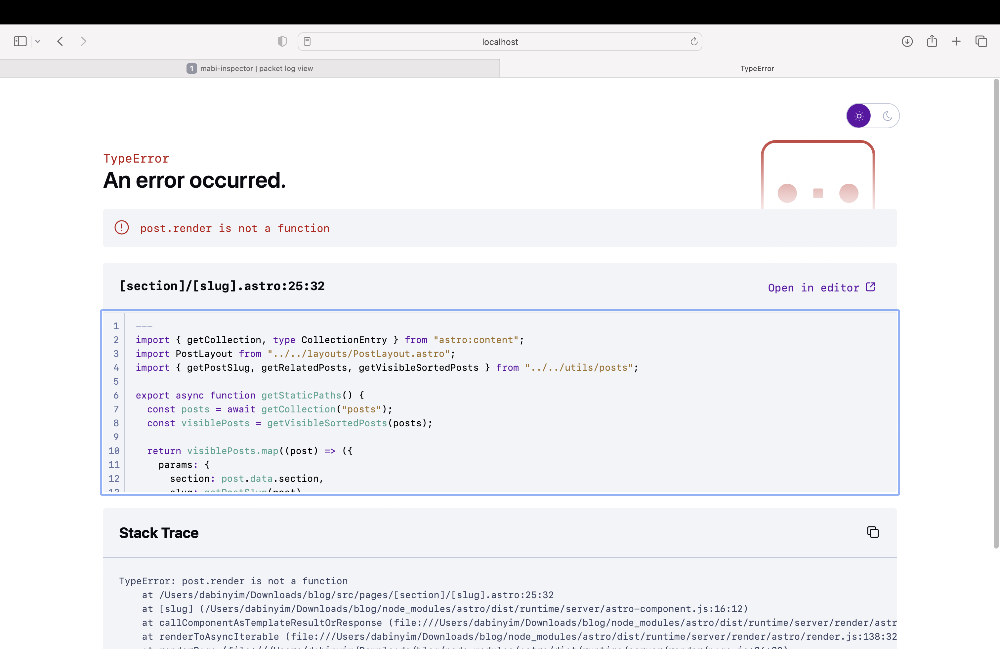

이 글은 한국어 기본 Markdown 포스트 예시다. 짧은 플레이 메모, 스크린샷, 감상 정리 정도라면 굳이 복잡한 컴포넌트 없이도 충분히 읽기 좋은 글을 만들 수 있다.

## 왜 이런 장면이 기억에 남는가

요즘 게임은 빠르게 보상 루프를 돌리는 경우가 많지만, 이런 생활형 MMO는 아주 작은 퀘스트 하나만으로도 이상하게 분위기가 남는다. 여우를 찾고, 간단한 안내 문구를 읽고, 주변 필드를 잠깐 둘러보는 흐름 자체가 느긋하다.

## 화면에서 좋았던 점

- UI가 촘촘하지만 각자의 역할이 분명하다.
- 퀘스트 창이 과하게 세련되지 않아서 오히려 생활감이 있다.
- 전투보다 동선과 분위기를 먼저 읽게 만든다.

## 짧은 플레이 노트

이런 종류의 장면은 “대단한 보스전”보다 더 오래 기억에 남을 때가 있다. 해야 할 일은 작고, 배경은 평화롭고, 화면 위 요소는 많지만 전체 리듬은 조용하다. 그래서 스크린샷 한 장만으로도 글 소재가 된다.

> 큰 사건이 없어도, 한 장면의 감촉을 기록하는 것만으로 충분히 좋은 게임 글이 된다.

## 태그 예시

이 포스트는 `mabinogi`, `quest-log`, `cozy-mmo`, `korean`처럼 비교적 가벼운 태그를 달아 두었다. 섹션은 `game`으로 고정하고, 태그로 세부 결을 나누는 방식이다.
