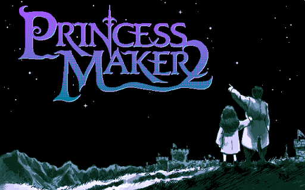
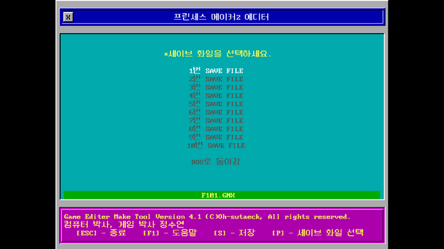
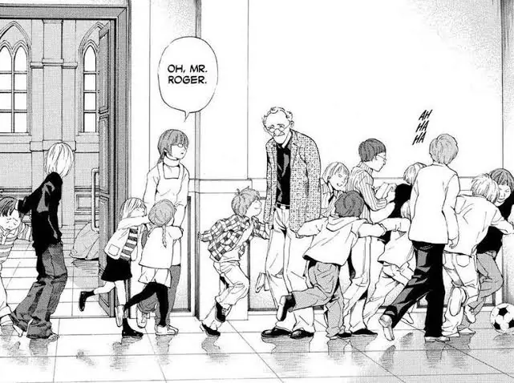
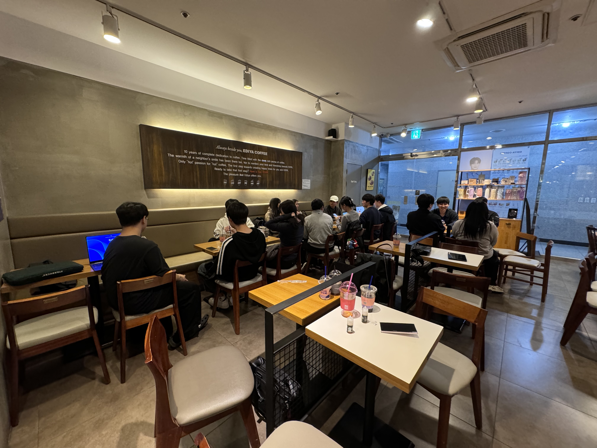
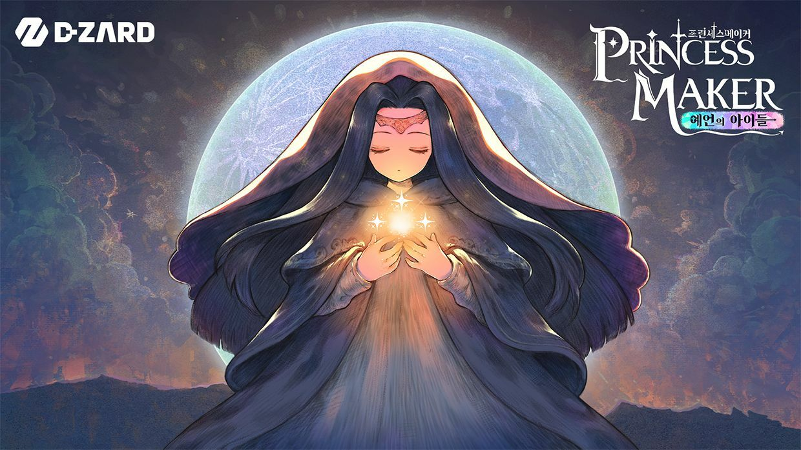

## 바쁜 분들을 위한 LLM 요약버전

어릴 때부터 나는 게임을 단순히 플레이하는 데서 끝나지 않고, 그 안을 바꾸고 들여다보는 일에도 자연스럽게 끌렸다.  
그 관심은 결국 컴퓨터와 분석, 그리고 게임보안에 대한 흥미로 이어졌다.

와미즈하우스스쿼드는 그런 흐름 위에서 만든 공간이다.  
게임을 좋아하는 사람들이 모여, 게임을 기술적으로도 바라보고 기록하고 공유하는 블로그.  
기술만이 아니라 게임 리뷰, 프로젝트 로그, 삽질 기록, 가벼운 이야기까지 함께 담아보려고 한다.

잘 정리된 결과물만 올리는 곳이라기보다는,  
좋아해서 파고들고, 배우고, 만들고, 그 과정을 남기는 공간에 가깝다.

우리가 보려고 만들었지만,  
게임을 좋아하는 사람, 게임 리버싱이나 게임보안이 궁금한 사람, 남들이 어떻게 삽질하는지 궁금한 사람에게도 꽤 재미있는 공간이 되었으면 한다.

---

## 1. 게임의 또 다른 매력

올해로 만 35세, 이제는 청년을 지나 중년의 세상으로 나아가는 나이.  
내 연배쯤이라면 누구나 한 번쯤 해봤을 궁극의 게임이 있다.  
프린세스 메이커 시리즈와 포켓몬스터 시리즈.

어떤 시리즈를 처음 접했는지는 나이대에 따라 조금 다르겠지만, 아마 이 글을 읽고 있는 분들이라면 나와 비슷한 경험을 했을 거라고 생각한다.

윈95가 대중화 되기도 전, MS-DOS를 쓰는 CLI 시절, `pm2.exe`를 실행하면서 나는 또 다른 프로그램도 종종 찾았다.  
`editor.exe`라는 이름의 프로그램이었다.

이 프로그램을 실행해서 내가 저장한 딸의 세이브 데이터를 불러오면, 그 안에서 나는 내가 원하는 모든 걸 조정할 수 있었다.  
인물들과의 관계, 전사평가, 내 딸의 능력, 신체 치수, 집안 내 자산인 골드까지.

포켓몬스터 레드 버전을 할 때에는, 이제는 이름도 기억나지 않는 2P를 지원하는 CLI 기반 에뮬레이터를 쓰며 친구네 집에서 키보드 하나로 두 개의 게임을 띄워 즐겁게 놀았던 기억이 난다. 자칭 교내 포켓몬 마스터로 통했던 나는 자랑하듯 얘기했다.  
전설의 포켓몬 알아, 뮤? 뮤츠의 어버이 되는 포켓몬이래. 원래는 못 잡지만 치트키를 쓰면 잡을 수 있어.

무슨 의미인지도 모르는 채로 포켓몬스터 레드 버전 일본어판을 하며, 무슨 뜻인지도 모르는 영어 메뉴들 사이로 치트 코드를 입력했다.  
그러면 신기하게도 내 가방 안에 있는 아이템이 원하는 아이템으로 바뀌었고, 하이퍼볼을 마음껏 구매할 수 있을 만큼의 돈이 생겼고, 풀숲에서는 내가 원하는 모든 포켓몬을 만날 수 있었다.

어릴 때 컴퓨터로 게임을 해본 사람이라면 이런 경험을 한 번쯤은 해봤을 것이다.  
그 행위가 무엇을 의미하는지 제대로 알게 된 건 중학생 이후의 이야기다.

다른 수많은 컬처들이 그렇듯, 게임은 우리가 겪어보지 못한 세상을 상상하고, 꿈꾸고, 성장하게 만든다.  
그것이 게임의 매력이다.

게임에서만 할 수 있는 일들을 하며 나는 꿈을 키워갔다.  
어릴 때 보았던 파란 화면의 글씨, `editor.exe`를 실행하면 그 아래에는 개발자의 이름과 함께 "컴퓨터 박사"라는 딱지가 당당하게 붙어 있었다.

실로 탐나는 직함이었다.  
이 프로그램을 만든 사람은 정말 천재 같아, 어떻게 내가 원하는 대로 마음대로 바꿀 수 있게 해주지?

치트키나 메모리 변조 같은 말을 알기 한참 전, 고작 여섯 살에 불과한 나는 그 "컴퓨터 박사"가 되면 나 역시 이런 걸 만들 수 있을 거라고 생각했다.  
게임은 그 자체로도 너무나 매력적인 세상이지만 컴퓨터를 배운다면 내가 직접 그 매력적인 세상에 좀 더 깊게 다가갈 수 있을 것 같았다.

그게 바로 내 시작이었다.

---

## 2. 와미즈하우스, 그게 뭔데 십덕아

나와 친한 이들은 나를 이름 대신 닉네임으로 부를 때도 많다. 나 역시 그것이 싫지 않다. 좀 더 어린 시절에는 인터넷상의 자아가 강했기에, 이름보다 닉네임으로 불리는 걸 더 선호했다.

이 글을 보고 계신 여러분들은 나를 어떤 이름으로 알고 있고, 어떤 이름으로 부르고 있을까?  
다빈, 엘, luminari, GitHub의 moonhug?  
어느 쪽이든, 모든 이름의 근원은 내 본명인 "빛날 빈" 자와 가까운 '빛'에서 출발한 닉네임들이다.

초등학생 때부터 쓰던 닉네임인 영문자 L은 그냥 어감이 좋아서 골랐다. 라틴어 *lux*에서 따온 것도 맞다.

중학생이 되니 데스노트라는 작품이 세상에 등장했다.  
요즘에서야 전형적인 geeky한 천재 타입의 INTP 캐릭터가 정형화되어 있지만, 그 시기에 나온 라이벌로서의 L이라는 존재를 보고 나는 웃을 수밖에 없었다.  
아, 수가 적긴 해도 이런 타입의 사람들이 없지는 않구나.

이미 나는 중학생 때부터 MBTI INTP 커뮤니티에도 가입해 있었다. 그 카페에 가면 데스노트의 엘 이야기가 꼭 빠지지 않고 나왔던 걸로 기억한다. 워낙 센세이셔널한 작품이었으니까.  
그리고 그 엘이 자란 곳이 와미즈하우스라는 곳이다.

데스노트의 주인공은 라이토이고 그가 극을 이끌어가지만, 라이벌인 엘 이후로도 그들의 후계자나 마찬가지인 니아와 멜로가 등장해서 라이토의 적수가 된다. 니아와 멜로 또한 와미즈하우스 출신으로, 자기가 할 수 있는 것들을 하면서 충실히 역할을 이어간다.  
그래서 내게 와미즈하우스라는 이름은 단순히 엘 한 사람의 공간이 아니라, 무언가를 이어받고 자기 방식대로 해내는 사람들의 공간으로 남아 있다.

나는 이전부터 뭔가 게임과 관련된 이야기를 하고 싶은 공간이 필요하다고 느껴왔는데, 적당한 명분이 필요하기도 했다.  
혼자서 하는 건 혼자서도 충분했으니까. 혼자가 아니라 누군가와 함께 하는 과정 자체도 즐기고 싶었다.  
마침 작년에 내가 진행한 게임보안 프로젝트가 국가에서 우수 프로젝트 상을 받기도 했고.

그래서 게임보안 -공격과 방어-라는 주제로 함께한 아이들을 찾았다.  
나는 미리 앞길을 조금 걸어보고 좀 더 오래 게임을 좋아한 사람으로서 주니어들을 가르쳤지, 무언가 엄청 대단한 기술력을 알려준 건 아니다.

인복이 많아서 나에게는 항상 좋은 구성원들이 기꺼이 먼저 내 곁으로 와주었고, (이 자리를 빌려 함께해준 모든 PL님과 멘티들에게 감사함을 표한다.) 수상 여부와 상관없이 내가 맡은 모든 팀에서, 내가 원했던 만큼 다들 알아서 배워갈 것을 배워갔다고 생각한다.

하지만 내가 진짜 그들과 함께하고 싶었던 건 단순히 보여주기 위한 결과가 나오는 단기성 프로젝트가 아니었다.  
좋아하는 게임의 매력을 알고, 그 게임을 직접 분석하고 바라볼 수 있는 능력을 키우는 것. 그걸 함께하고 싶었다.

화이트햇스쿨의 매 기수가 끝난 이후에도 나는 종종 멘티들과 연락하고 지내왔다. 언젠가 게임을 좋아하는 이들이 모여, 그와 관련된 블로그를 만들어 운영하고 싶다고도 했다.  
마침 올해는 화이트햇스쿨 일정도 조금 밀렸고 시간적 여유도 나서, 드디어 품어온 마음을 드러낼 수 있을 것 같았다.

와미즈하우스스쿼드라는 이름은, 스펠링의 앞글자를 따면 화이트햇스쿨인 WHS와도 같다. 이것도 노린 지점이다.  
아이디어를 제공한 건 짝(anch0vy)입니다. 컨셉질이 중요하다고 배웠죠. 이럴 때 아니면 오타쿠로서 언제 또 컨셉질을 해보겠습니까?

아무튼 그렇다.  
엘과 아이들. 그들이 있는 곳은 와미즈하우스. 그런 우리가 모였으니 스쿼드.  
함께일 때, 우리는 즐거웠으니까.

와미즈하우스스쿼드는 우리들이 게임이라는 큰 주제로 만들어나가는 공간이 될 것이다.

---

## 3. 그래서 뭘 쓰고, 왜 만들었는데? 누구랑?

한국에는 수많은 게임 커뮤니티가 있지만, 게임보안이라는 기술적 측면에서 개인들이 모여 꾸준히 아티클을 내는 곳은 없는 걸로 안다. (있다면 죄송합니다. 기업 말고, 오로지 개인이요.)

게임을 좋아하는 우리가 있고, 마침 우리는 그걸 프로젝트로 할 만큼의 열정도 있다.  
기술은 배우면 된다. 문제는 파편화된 글들이다.

내가 어릴 때는 한국어로 된 문서도 없었고, 보안이라는 개념조차 희박했던 시기였기에 못하는 영어로 해외 커뮤니티까지 기웃거리며 사혼의 구슬 조각 찾듯 어설프게 기술을 익혀왔다. 지금에서야 보안이라는 주제가 정말 국가적으로 화두가 되고 누구나 사이버 보안의 중요성을 얘기하지만, 한국에서 게임보안의 입지는 여전히 마찬가지 아닌가 싶었다.

요즘 젠지 세대의 게임 방식은 내가 자란 PC 산업의 고도화 시대와는 많이 다르게 느껴졌다. 예전처럼 한 게임을 깊게 파고드는 방식과도 결이 달라 보여, 처음에는 내가 굳이 이런 주제를 붙잡는 게 시대의 역행 아닌가 싶기도 했다. 화이트햇스쿨을 처음 시작할 때도 과연 이 게임보안이라는 지루한 주제에 누가 관심이나 가질까 싶었는데... 의외로 인기가 좀 있었다. 그래서 나는 3기수 동안 5개 이상의 게임보안 프로젝트를 진행했다.

함께한 이들의 열정과 노고는 누구보다 내가 제일 잘 알고, 함께한 이들이 안다.

아마 이곳에 올라올 글들은 너무 딥하거나 진중한 기술적 주제만 다루지는 않을 예정이다. 가벼운 유희거리부터, 정말 "이건 내가 아니면 누가 하겠어?" 싶은 것들까지 올라올 것이다.  
남들이라면 하지 않을 길을 걸어가고, 그 과정을 기록으로 남기는 일도 누군가에게는 도움이 되지 않을까 하는 생각이다.

기술만이 아니라, 게임, 프로젝트, 게임 리뷰, 그 외 잡다한 아티클들을 남기고 싶었다. 나만이 아닌, 우리 모두가 함께하는 방식으로.

나는 언제나 결과보다 과정을 중요시하는 사람이라 꼭 유의미한 산출물이 나오지 않아도 상관없다.  
좋아서 하면 그만이야.

그래서 앞으로 다룰 내용은 크게 다음과 같다.

- **Tech** - 기술적인 초점에 맞춘 포스트가 주로 올라올 예정
- **Game** - 게임 리뷰, 게임 추천, 게임과 관련된 잡다한 이야기들

어쨌든 큰 틀은 게임이다.  
한 살이라도 어릴 때 더 많은 게임을 해야 한다는 것이 내 지론이다.

조금 정제된 언어로 다듬자면, 이런 글들을 내는 게 목표다.

- 기술
- 게임
- 프로젝트 로그
- 분석 / 리뷰 / 삽질 기록
- 가끔은 가벼운 글도

---

## 4. 타깃 독자는?

우리가 보려고 만듦.  
이러면 좀 시시해 보이죠.

하지만 내가 언제 무언가를 했고, 어떤 과정을 거쳤는지 미래의 내가 다시 봐도 알 수 있게 남겨두는 건 정말 중요하다. 세련된 단어를 쓰자면 아카이빙, 문서화라고도 할 수 있겠다.

아마 이런 분들에게는 꽤 재미있게 읽힐지도 모르겠다.

게임을 좋아하는 분, 게임 리버싱을 해보고 싶은 분, 게임보안이 어떤 것인지 궁금한 분, 실제로 남들은 어떻게 삽질하는지 궁금한 분.

개인적인 목표는 이렇다.

- 너무 무겁고 딱딱하게만 쓰지 않겠다.
- 결과만이 아니라 과정도 적겠다.
- 완벽한 정리글만이 아니라 진행 중인 기록도 올리겠다.
- 나중의 내가 다시 봐도 이때 무얼 했는지 알 수 있게 쓰겠다.

아카이브이기도 하고, 실험실이기도 하고, 공개 작업실이기도 하고, 때로는 소소한 이야기까지 남길 수 있는 공간.

원래 해커는 누가 시키지 않아도 재밌어서 하고, 그걸 공유하는 게 해커 정신이라고 생각한다.  
철저히 주관적인 해커 정신에 의해 쓰일 글들. 기대해주세요.

---

## 5. 첫 아티클은?

작년 루비야랩 세미나에서도 잠깐 발표하며 넘어갔는데,  
서론에 프린세스 메이커로 시작했으니 당연히 프린세스 메이커 신작 이야기가 나와야겠죠?

기술적인 이야기보다 먼저, 오래된 게이머로서 20년 넘게 딸을 기다린 양육자의 마음으로 써보려고 한다.  
이제는 정말 딸이 있어도 이상하지 않은 나이가 되었기에, 그 게임을 만든 이들의 노고까지도 함께 생각하면서.

---

## 6. 첫 글을 마치며

지금 함께하기로 한 분들은 전원 화이트햇스쿨 출신으로, 기초적인 해킹과 개발에 대해서는 어느 정도 알고 있는 분들이다.

아직 인원은 전부 공개할 수 없지만, 나를 포함해 약 10명 내외로 꾸려진 인원이다. 인당 반년에 한 개 이상의 아티클을 내는 것이 목표인데, 모쪼록 앞으로 함께할 이들과 재밌는 시간을 보내고, 봐주시는 분들도 그만큼 즐겁게 봐주셨으면 좋겠다.

---

> 이곳에 올라오는 모든 내용은 악용을 위한 게 아닌, 개인 연구와 분석을 바탕으로 작성합니다.  
> 앞으로 올라오는 모든 포스팅은, 한국어와 AI로 번역된 영어로 함께 게시됩니다.  
> 문제가 있거나 문의가 필요한 경우 `moonhug@icloud.com` (임다빈) 으로 연락 부탁드립니다.

---

## Starting Wammy's House Squad

## LLM Summary for Busy People

Ever since I was a kid, I was never satisfied with just *playing* games. I was naturally drawn to changing them, peeking inside them, and figuring out how they worked.  
That curiosity eventually led me to computers, analysis, and finally an interest in game security.

Wammy's House Squad came out of that trajectory.  
It's a blog built by people who love games and want to look at them not just as players, but also from a technical angle--recording, sharing, and thinking through what we find.

This won't be a place for polished results only.  
It's closer to a space for digging into things because we love them, learning as we go, building things, and leaving a record of the process.

We made it for ourselves first.  
But hopefully it'll also be interesting to people who love games, people curious about game reversing or game security, and people who just want to see how others stumble around and figure things out.

---

## 1. Another Kind of Appeal in Games

I'm 35 this year. At this point I'm no longer exactly "young"--I'm starting to move past youth and into whatever comes next.

If you're around my age, there are probably a few defining games you almost certainly touched at some point.  
For me, two of them were the *Princess Maker* series and the *Pokemon* series.

Which one you encountered first probably depends on your exact age bracket, but if you're reading this, there's a decent chance your experience wasn't all that different from mine.

Back in the CLI days, before Windows 95 really went mainstream, when we were still running MS-DOS, I used to launch `pm2.exe`--and while doing that, I often went looking for another program too.  
A program called `editor.exe`.

If I launched that program and loaded the save data for the daughter I had been raising, I could tweak basically anything I wanted inside it.  
Relationships with other characters, combat evaluations, my daughter's stats, body measurements, even the amount of gold my household had.

When I was playing Pokemon Red, I also used some old CLI-based emulator with 2-player support--its name is long gone from my memory now. I still remember going to a friend's house, running two game instances off one keyboard, and having an absurd amount of fun. Back then I proudly thought of myself as the school's Pokemon master. I'd brag about things like this:  
"You know the legendary Pokemon Mew? It's supposed to be the parent of Mewtwo. You can't catch it normally, but if you use a cheat code, you can."

Without really understanding what any of it meant, I played the Japanese version of Pokemon Red and typed cheat codes into English menus I didn't even understand.  
And somehow, magically, the items in my bag would turn into whatever I wanted. I'd suddenly have enough money to buy as many Hyper Balls as I wanted. In the grass, I could encounter any Pokemon I wanted.

Anyone who grew up playing computer games probably had at least one experience like that.  
I didn't really understand what those actions *meant* until much later, after I was already in middle school.

Like so many other forms of culture, games let us imagine worlds we've never lived in. They make us dream. They make us grow.  
That, to me, is one of the great appeals of games.

Doing things inside games that were only possible *because* they were games, I started building dreams of my own.  
I still remember that blue text on the screen. When I launched `editor.exe`, the developer's name would appear below it, along with a proud little label: "Computer Doctor."

That title was unbelievably cool to me.  
This person must be a genius, I thought. How could they make something that lets me change the game exactly the way I want?

Long before I knew words like cheat code or memory modification, six-year-old me believed that if I became a "computer doctor," I'd be able to make things like that too.  
Games were already an incredibly fascinating world on their own, but I felt that if I learned computers, I could get even closer to that world myself.

That was the beginning for me.

---

## 2. Wammy's House -- What Even Is That, You Huge Nerd?

People close to me often call me by a nickname instead of my real name. I don't mind that at all. If anything, when I was younger, my internet identity felt stronger than my offline one, so I actually preferred being called by a nickname.

If you're reading this, what name do you know me by?  
Dabin? L? luminari? moonhug on GitHub?  
Whatever it is, most of those names ultimately trace back to the same place: the "light" associated with my given name.

I'd been using the nickname `L` since elementary school. I picked it partly because I liked how it sounded, and yes, it was also taken from the Latin word *lux*.

Then I got to middle school, and *Death Note* entered the world.  
These days, the geeky genius-type INTP character is almost a stereotype. But back then, seeing a character like L--a rival figure with that kind of energy--just made me laugh.  
So people like this *do* exist, even if there aren't many of them.

I was already active in MBTI INTP communities in middle school, and I remember that people in those forums talked about L from *Death Note* constantly. The series was that much of a cultural event.  
And L was raised in a place called Wammy's House.

The protagonist of *Death Note* is Light, and he drives the story, but after L there are also Near and Mello--figures who are basically his successors, and who become Light's opposing force in their own ways. Near and Mello are also from Wammy's House, and they each carry that role forward in the way only they can.  
So to me, the name *Wammy's House* never meant just a place that belonged to L alone. It stayed with me as the name of a place where people inherit something, then carry it forward in their own way.

For a long time, I felt like I needed some kind of space where I could talk about games in this kind of way--but I also needed the right reason to actually do it.  
If I were going to do something alone, I could already do that alone just fine. What I wanted was to enjoy the process of doing it *with other people*.  
As it happened, one of the game security projects I ran last year ended up receiving a national-level excellence award.

So I went looking for the people I had worked with under the theme of game security--offense and defense.  
I was just someone who had walked this road a little earlier than they had, and someone who had loved games for a little longer. I wasn't trying to pretend I had some god-tier secret technique to hand down.

I've been lucky with people. Good teammates have often chosen to come stand beside me first, and I want to take this chance to thank every PL and mentee I've worked with. Whether we won anything or not, I think every team I led learned what they needed to learn, and learned it well.

But what I really wanted to do with them was never just a short-term project built to produce a result for show.  
What I wanted was to help cultivate the ability to understand the appeal of games, and to look at them analytically with your own eyes. That was what I wanted to do together.

Even after each White Hat School cohort ended, I stayed in touch with many of those mentees. At some point I started saying that I wanted to build and run a blog with people who loved games and wanted to write about them together.  
This year, the White Hat School schedule got pushed back a bit, and I found myself with a little more room to breathe. So it finally felt like the right time to bring that long-held idea into the open.

The name *Wammy's House Squad* also happens to line up with the initials **WHS**, just like White Hat School. Yes, that part was intentional too.  
The original idea came from my partner, anch0vy. I was taught that committing to the bit matters. And really, if I'm not going to lean into being a nerd for something like this, then when exactly am I supposed to do it?

Anyway, that's the idea.  
L and the kids. The place they come from is Wammy's House. We gathered together, so: Squad.  
We were happy when we were together.

Wammy's House Squad is going to be a space where we build something around the broad theme of games.

---

## 3. So What Are We Writing, Why Are We Making This, and With Who?

There are plenty of game communities in Korea. But as far as I know, there aren't many places where individuals consistently write and archive articles from a *game security* angle. If there is one, my apologies. I mean independent people doing it--not companies.

We love games, and we care enough about them to build actual projects around them.  
The technology can be learned. The real problem is how fragmented the writing is.

When I was younger, there weren't even many Korean-language resources, and the concept of "security" itself was much fuzzier than it is now. So I ended up lurking around overseas communities in English I barely understood, picking up bits and pieces of knowledge like I was collecting shards of the Shikon Jewel. These days, security is a national-level talking point, and everybody talks about the importance of cybersecurity, but the position of *game* security in Korea still feels pretty much the same to me.

The way Gen Z engages with games feels pretty different from the era I grew up in--the era when the PC industry was rapidly maturing. It also feels different from the older pattern of diving deep into a single game for a long time. Because of that, I sometimes wondered whether choosing to hold onto this topic at all was a kind of going against the times. When I first started at White Hat School, I honestly wondered who would even be interested in something as seemingly dry as game security.  
Turns out, more people were interested than I expected. I ended up running more than five game security projects across three cohorts.

Nobody understands the passion and labor of the people who worked with me better than I do--and they know it too.

The things posted here probably won't be only ultra-deep or overly serious technical writing. Some of it will be light and playful. Some of it will be the kind of thing where you think, "Honestly, if I don't write this, who will?"

I also think there's value in taking roads most people wouldn't bother with, and leaving behind a record of that process. That kind of thing can end up being useful to someone.

I wanted to leave behind not just technical writing, but also games, projects, reviews, and all kinds of miscellaneous game-related writing. And I wanted it to be something all of us could build together, not just something for me alone.

I've always cared more about process than outcomes.  
So even if a project doesn't produce some grand, "meaningful" final result, that's fine.  
If we're doing it because we love it, that's enough.

Broadly speaking, here's what we want to cover:

- **Tech** -- posts with a stronger technical focus
- **Game** -- game reviews, recommendations, and all kinds of game-adjacent rambling

At the end of the day, the big frame is simple:  
games.

My personal belief is that you should play as many games as you can while you're still young enough to do it with full energy.

If I had to phrase the goal a little more cleanly, it would look something like this:

- technology
- games
- project logs
- analysis / reviews / troubleshooting records
- and occasionally, lighter posts too

---

## 4. Who Is This For?

Honestly? We made it for ourselves.  
Sounds kind of lame when you say it like that, right?

But it matters--a lot--to leave behind something that lets future-me see what I was doing, when I was doing it, and how I got there. If you want a fancier term for it, sure: archiving, documentation, whatever you want to call it.

That said, I think it could also be fun for people like this:

People who love games.  
People who want to try game reversing.  
People who are curious about what game security even is.  
People who want to see how other people actually struggle through things and figure them out.

Personally, this is the kind of place I want this to be:

- not overly heavy or stiff
- focused not just on results, but on process
- open not only to polished writeups, but also ongoing records
- written in a way that lets future-me understand what I was doing back then

Part archive, part lab, part public workshop, and sometimes just a place for small stories too.

My view of hacker spirit has always been simple: real hackers do things because they're fun, even if nobody tells them to--and when something is fun, they share it.  
So the posts here will be written in a thoroughly subjective version of that hacker spirit. Hope you enjoy them.

---

## 5. What Will the First Article Be?

I briefly mentioned this during last year's RubiyaLab seminar, but since this post opened with *Princess Maker*, it only makes sense that the first real article should go there too.

Before I start with something more technical, I want to write first as an old gamer--  
as someone who has been waiting over twenty years for this daughter.

At this age, I'm old enough that actually having a daughter of my own wouldn't even be strange anymore, and that makes me think not only about the game itself, but also about the people who spent all that time making it.

---

## 6. Closing This First Post

Everyone currently joining me in this is from White Hat School, and they all have at least a basic foundation in hacking and development.

I can't reveal everyone yet, but including myself, we're looking at roughly around ten people. The goal is for each person to publish at least one article every half year. More than anything, I hope this becomes something fun and lasting for the people building it together--and just as enjoyable for the people reading it.

---

> Everything posted here is based on personal research and analysis, not for malicious use.  
> All future posts will be published in both Korean and English, with the English version translated using AI.  
> If there are any issues or inquiries, please contact `moonhug@icloud.com` (Dabin Yim).
