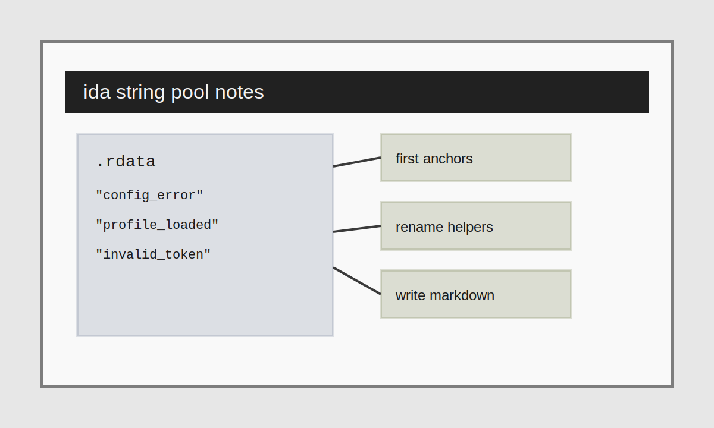

This sample post uses plain Markdown only. It is the default workflow for the project and should cover most write-ups without requiring any custom components.

## Why this format is the default

Markdown is the easiest format for collaborative editing on GitHub. A junior contributor can open one file, update frontmatter, write the body, and submit a pull request without learning Astro components first.

## Quick process

1. Open the binary in IDA.
2. Mark obvious string references.
3. Rename the noisy helper calls first.
4. Capture screenshots or diagrams in the same folder as the post.
5. Write the article in `index.md`.

## What we want contributors to capture

- What the sample appears to do at a high level.
- Which strings or data tables were the first useful anchor.
- What naming choices were made during analysis.
- What still feels uncertain after the first pass.

## Notes on tags

The top-level `section` is strict and should stay either `tech` or `game`. Tags stay free-form so people can add topics like `ida`, `x64dbg`, `unity`, or `co-op`.

> Keep the structure stable and let the article body stay flexible.

## Closing thought

If a post mostly needs headings, lists, code fences, and one or two local images, stay with Markdown. It is the simplest path and the best starting point for a collaborative repo.
