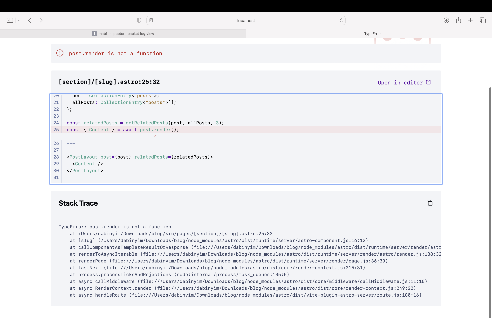

이 글은 한국어 기술 메모 예시다. 리버싱이나 패킷 분석처럼 어려운 주제를 다룰 때도, 처음부터 거창한 결론을 쓰기보다 “지금 화면에서 뭘 먼저 읽을지”를 적어 두는 방식이 훨씬 협업에 도움이 된다.

## 처음 볼 때 가장 먼저 보는 것

스크린샷만 놓고 봐도 모든 정보를 한 번에 이해하려고 하면 바로 지친다. 그래서 나는 보통 아래 순서로 본다.

1. 지금 선택된 패널 이름이 뭔지 확인한다.
2. 리스트와 상세 영역 중 어디가 기준인지 먼저 구분한다.
3. 숫자, 길이, 식별자처럼 반복되는 패턴을 찾는다.
4. 당장 모르는 건 이름을 붙이지 말고 화면 메모로 남긴다.

## 초보자에게 중요한 포인트

- 도구를 처음 열었을 때 “다 이해해야 한다”는 압박을 버린다.
- 보이는 텍스트, 숫자, 반복 구조부터 적는다.
- 추측과 사실을 분리해서 기록한다.

## 왜 이런 메모가 유용한가

공개 레포에서 같이 글을 쓰면, 누군가는 나보다 먼저 맥락을 알고 있고 누군가는 완전히 처음 볼 수 있다. 그럴 때 제일 도움이 되는 건 정답보다 **진입 경로**다. 이 화면에서 어디부터 보면 되는지 적어 두면, 다음 사람이 같은 장면을 훨씬 덜 무섭게 본다.

## 다음 단계 예시

- 패널별 역할 가설 세우기
- 자주 나오는 값 캡처 정리하기
- 패킷 이름 규칙이 보이는지 확인하기
- 실제 분석 글로 확장할지 결정하기
