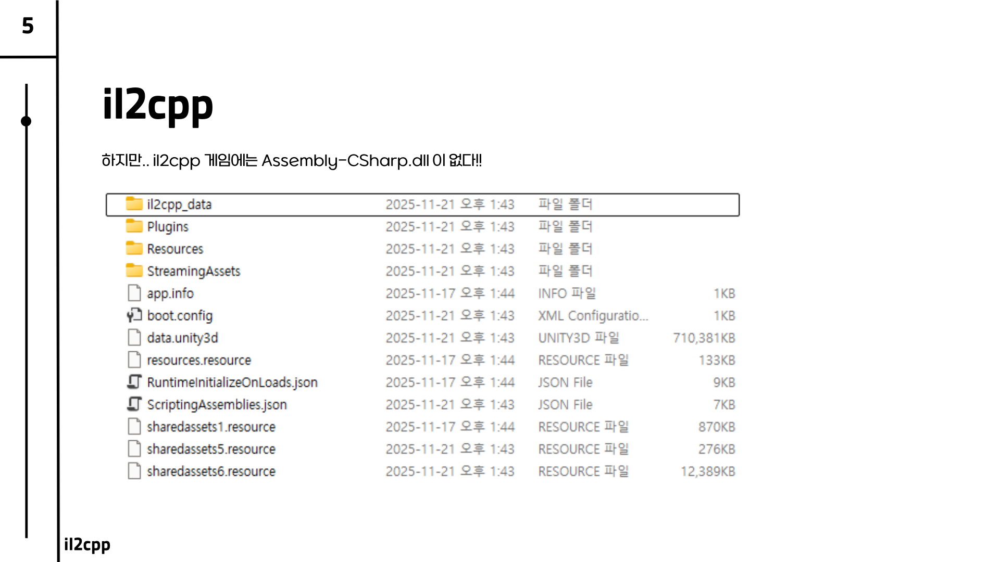
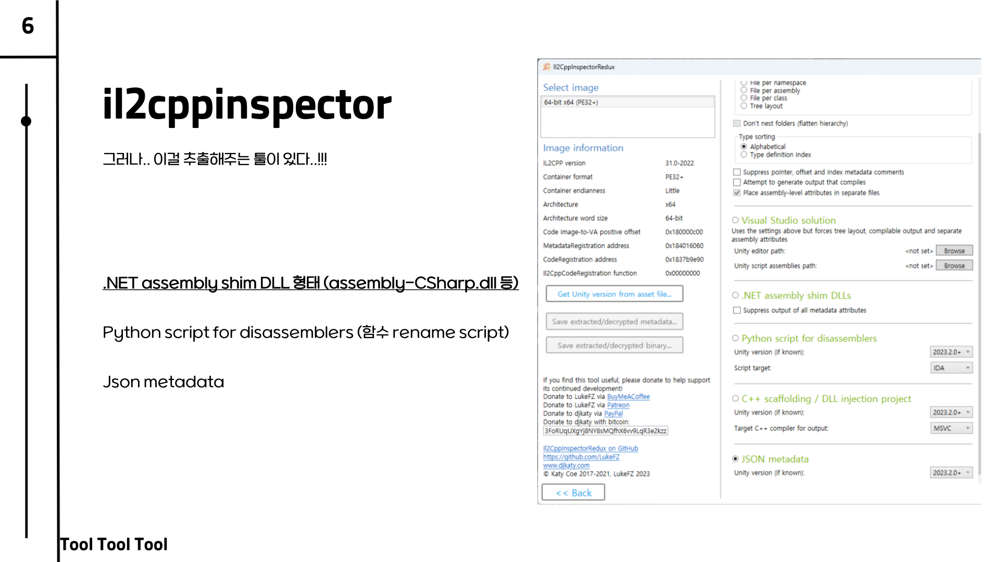
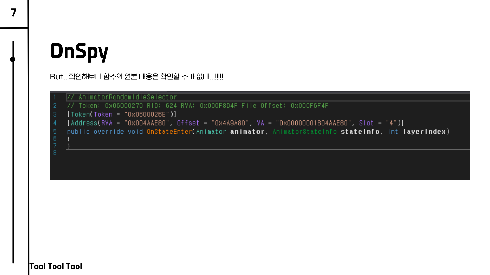
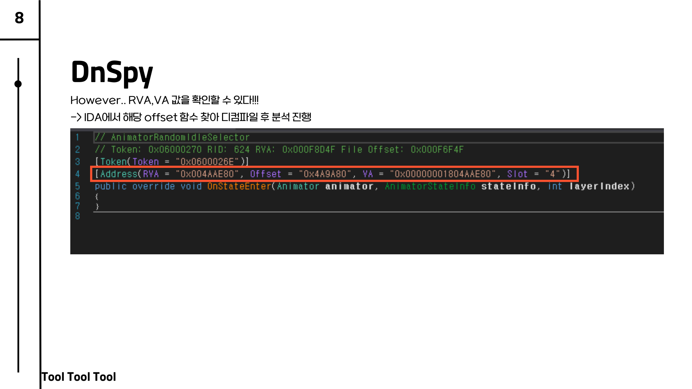
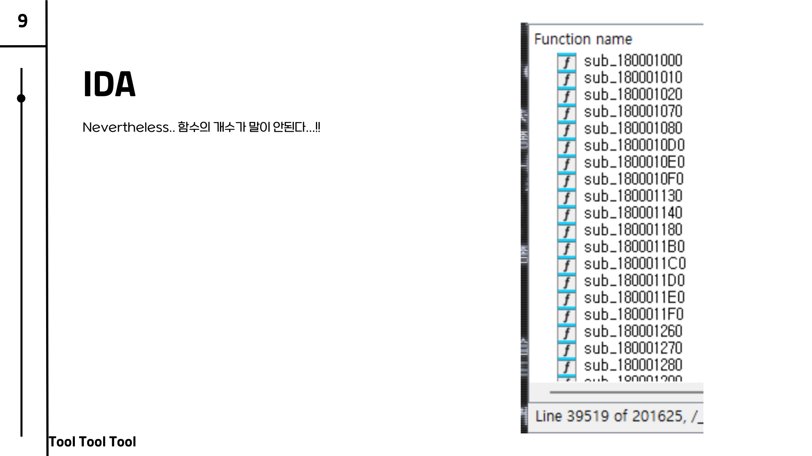
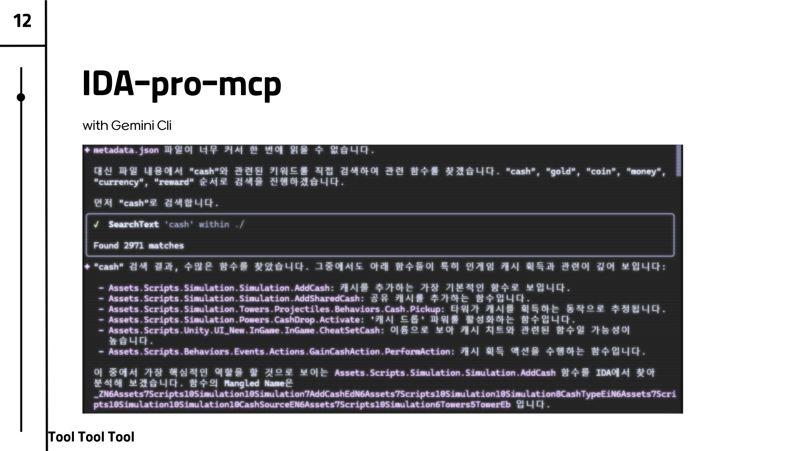
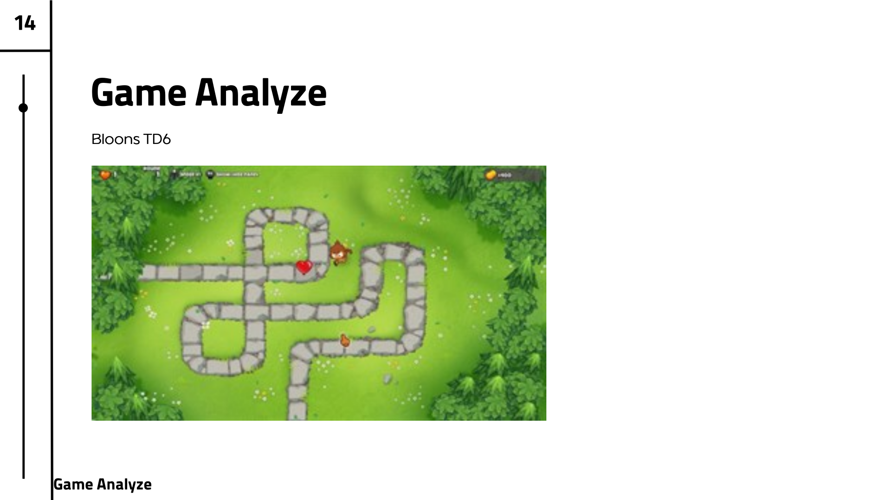
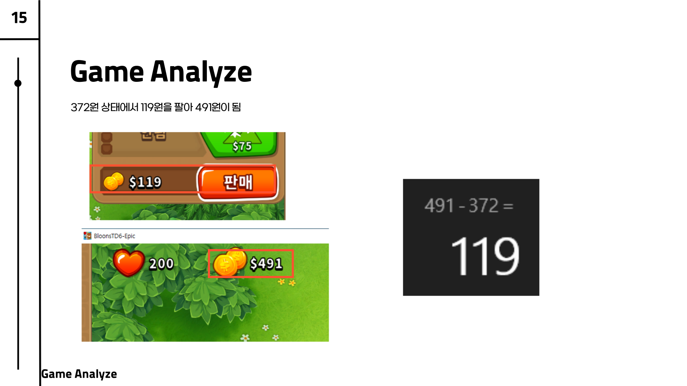
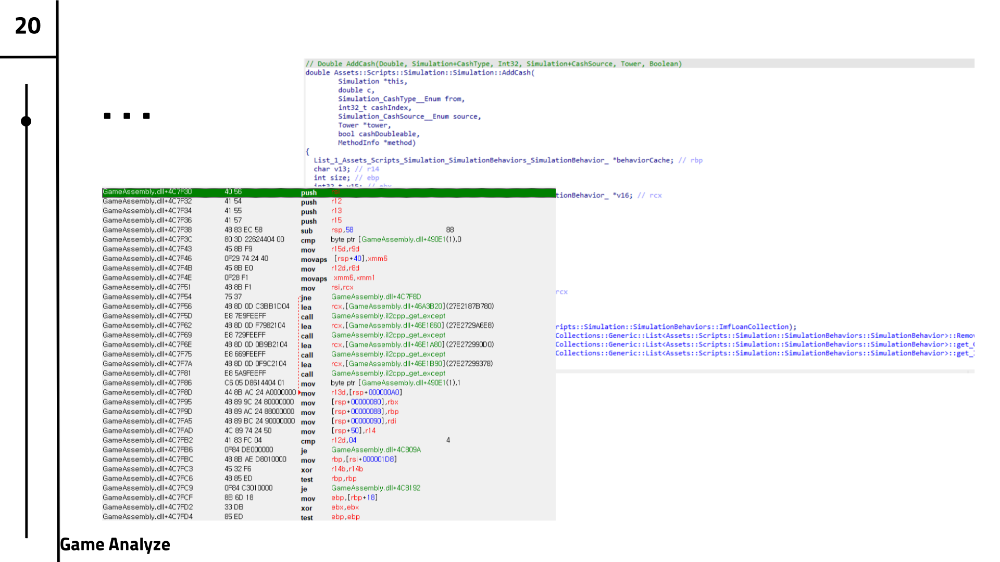

## 0. 들어가며

> ⚠️ **Disclaimer**
>
> 본 문서에 포함된 모든 분석 기법과 리버스 엔지니어링 사례는 오직 **순수 개인 학술 연구 및 보안 아키텍처 이해**를 목적으로 작성되었습니다.
> 특정 게임의 보안 무력화나 악의적 해킹, 상업적 이득, 저작권 침해를 돕거나 조장할 의도가 전혀 없음을 명확히 밝힙니다.

Unity는 게임 개발 엔진으로 널리 사용되고 있으며, C#을 기반으로 게임을 개발할 수 있습니다. 전세계의 수많은 인디게임 개발자들이 Unity를 통해 게임을 개발하고 있으며, Unity는 모바일, PC, 콘솔 등 다양한 플랫폼을 지원합니다.

이번 포스트에서는 Unity 게임의 두가지 스크립팅 백엔드 방식 중 **il2cpp** 기반의 게임을 분석해보고자 합니다.

---

## 1. 기반 지식: Mono vs il2cpp

본격적인 분석에 앞서, 우리가 어떤 환경과 직면하고 있는지 그 구조를 먼저 명확히 이해할 필요가 있습니다. Unity 게임의 동작 방식은 크게 Mono와 il2cpp 두 가지로 나눌 수 있습니다.

### 1-1. Mono

우선 **Mono 빌드**는 마이크로소프트의 .NET 프레임워크를 리눅스 등 다양한 운영체제에서 구동하기 위해 시작된 오픈소스 프로젝트인 'Mono'에 그 뿌리를 두고 있습니다. 이 방식에서는 작성된 C# 코드가 중간 언어인 IL(Intermediate Language)로 컴파일되며, 게임이 실행될 때 JIT(Just-In-Time) 컴파일러를 통해 기계어로 번역되어 동작하게 됩니다.

> **IL(Intermediate Language)과 JIT(Just-In-Time) 컴파일이란?**
>
> - **IL (중간 언어):** C#과 같은 코드를 특정 기기(CPU, 운영체제)에 종속되지 않게 1차적으로 번역해 둔 공통 언어 형태를 뜻합니다. `.dll` 파일의 내부는 바로 이 IL 언어로 이루어져 있습니다.
> - **JIT (실시간 번역):** 말 그대로 프로그램이 실행(Runtime)되는 순간에, 중간 언어인 IL 코드를 읽어 들여 현재 구동 중인 기기에 맞는 1과 0의 기계어로 실시간 번역해 주는 방식입니다. (반대로 실행 전 미리 번역해 두는 방식을 'AOT, Ahead-Of-Time'라고 합니다.)

이 구조의 가장 큰 약점이자 분석가 입장에서의 장점은, 빌드 결과물에 `Assembly-CSharp.dll`이라는 원본의 뼈대가 고스란히 남는다는 점입니다. 그렇기에 DnSpy 같은 툴에 파일을 올리기만 하면 원본에 가까운 코드가 훤히 들여다보일 만큼 분석이 매우 쉬워 사실상 보안에는 취약하다고 볼 수 있습니다.

그렇다면 유니티는 왜 초기에 이러한 Mono 방식을 전면적으로 채택했을까요? 개발 및 배포 과정에서 다음과 같은 강력한 이점을 제공했기 때문입니다.

- **크로스 플랫폼(Cross-Platform) 지원**: 개발자가 C#으로 게임 로직을 한 번만 작성하면, Mono 런타임이 Windows, Mac, Android, iOS 등 다양한 OS 환경에 맞춰 코드를 실행해 줍니다. 즉, 개발자가 각 플랫폼별로 네이티브 언어(C++, Objective-C, Java 등)를 각각 다룰 필요가 없어 파편화 문제를 획기적으로 해결했습니다.
- **빠른 개발 이터레이션(Fast Iteration)**: JIT 컴파일 방식을 사용하기 때문에, 유니티 에디터 내에서 코드를 수정하고 플레이 버튼을 누르면 즉각적으로 변경 사항을 테스트할 수 있었습니다. 전체 코드를 매번 빌드할 필요가 없었기 때문에 개발 주기가 매우 단축되었습니다.
- **C# 및 .NET 생태계의 이점**: .NET의 강력한 C# 라이브러리, 편리한 객체 지향 문법, 자동 메모리 관리(GC) 등을 그대로 이용할 수 있어 개발 생산성을 극대화할 수 있었습니다.

### 1-2. il2cpp

하지만 **il2cpp 빌드**는 Mono와는 다소 다른 구조를 가집니다. 이름에서 알 수 있듯, C# 코드를 IL 코드로 변환한 뒤 이를 다시 **C++ 코드**로 역변환시켜 최종 네이티브 기계어로 빌드해 버립니다. (AOT)

유니티가 기존의 Mono를 넘어 **il2cpp 방식을 추가로 도입한 핵심 이유**는 다음과 같습니다.

- **성능의 극대화**: 변환된 C++ 코드는 각 플랫폼의 최신 네이티브 C++ 컴파일러(LLVM, GCC 등)를 통해 컴파일됩니다. 이 과정에서 C++ 컴파일러가 제공하는 강력한 최적화를 거치게 되어, 결과적으로 기존 JIT 방식보다 월등히 뛰어난 실행 속도와 런타임 성능을 발휘합니다.
- **새로운 플랫폼 및 64비트 아키텍처 대응**: 모바일 생태계(특히 애플의 iOS)에서 64비트 아키텍처 지원이 필수로 자리 잡았을 때, 유니티가 Mono의 JIT 엔진을 모든 신규 하드웨어 아키텍처에 맞춰 재작성하고 유지보수하는 것은 매우 비효율적이었습니다. il2cpp는 어떠한 플랫폼이든 C++ 컴파일러만 갖춰져 있다면 쉽게 대응할 수 있는 뛰어난 이식성을 제공했습니다.
- **코드 보안 방어력 향상**: 앞서 언급한 분석가 입장에서의 치명적인 문제점을 완벽히 틀어막습니다. 네이티브 바이너리(기계어)로 완전히 빌드되어 배포되므로, Mono처럼 쉽게 DLL 리버싱 및 원본 코드 추적이 불가능해져 보안성이 비약적으로 상승했습니다.

이러한 과정으로 인해 빌드된 게임의 `il2cpp_data` 폴더를 아무리 뒤져보아도 `Assembly-CSharp.dll` 파일은 흔적조차 찾을 수 없습니다. 모든 코드는 C++ 기반의 네이티브 어셈블리 형태로 굳어져 있기에 일반적인 방법으로는 구조 자체를 파악할 수단이 차단되어 보안 방어력이 매우 뛰어납니다.

<!--  -->

---

## 2. 잃어버린 DLL을 찾아라: Tool Tool Tool..

`Assembly-CSharp.dll`이 소실된 il2cpp 빌드를 처음 마주하게 되면 눈앞이 캄캄하겠지만, 다행히도 강력한 툴체인을 하나로 엮어서 이 난관을 헤쳐나갈 수 있습니다.

### 2-1. il2cppinspector

첫 번째로 우리가 사용할 툴은 **il2cppinspector**입니다. 이 툴은 게임 내부에 남아있는 바이너리 형태의 메타데이터 파일(`global-metadata.dat`)을 정밀하게 분석하여, 함수와 클래스 껍데기만 존재하는 빈 `.NET assembly shim DLL`을 원본과 유사하게 복원해 냅니다. 이뿐만 아니라 복잡한 디스어셈블러(IDA 등) 환경에서 알아보기 힘든 네이티브 함수명을 원래의 C# 함수명으로 자동 매칭해 주는 Python Rename 스크립트까지 함께 제공해 주어, 전체 분석 과정의 가장 핵심적인 초석을 다지게 해줍니다.

### 2-2. DnSpy

이렇게 복원된 껍데기(Dummy DLL)는 곧바로 **DnSpy**의 훌륭한 분석 재료가 됩니다. 껍데기뿐인 파일이기에 실제 구현된 C# 코드는 비어 있지만, 게임 전체를 구성하는 클래스 구조와 함수 형태를 파악할 수 있습니다.

여기서 우리가 취해야 할 가장 중요한 수확은, 함수의 원본 로직은 확인할 수 없더라도 해당 함수가 네이티브 메모리 상의 어느 지점에 위치하고 있는지를 가리키는 **RVA(Relative Virtual Address)와 VA Offset 값**이라는 힌트를 확보할 수 있다는 것입니다.

> **RVA(Relative Virtual Address)와 VA(Virtual Address)란?**
>
> - **VA (가상 주소):** 프로세스가 실행되며 메모리에 로드될 때 부여받는 메모리 상의 절대 주소를 의미합니다. 프로그램이 실행될 때마다 메모리에 올라가는 기준 주소(Image Base)가 달라질 수 있어 유동적입니다.
> - **RVA (상대 가상 주소):** 프로그램이 메모리에 로드된 기준 주소(Image Base)로부터 얼마나 떨어져 있는지를 나타내는 상대적인 오프셋(Offset) 거리 값입니다. `(VA = Image Base + RVA)` 운영체제나 실행 환경에 의해 Image Base가 변하더라도 RVA 값 자체는 항상 일정하므로, 리버싱 과정에서 특정 함수의 위치를 변함없이 추적할 수 있는 핵심 지표가 됩니다.

### 2-3. IDA

마지막으로 DnSpy에서 얻은 구체적인 Offset 주소를 **IDA**에서 활용합니다. 게임의 실제 코드 로직이 담긴 네이티브 엔진 파일인 `GameAssembly.dll`을 IDA에 올린 뒤, 획득한 주소로 이동하여 해당 로직의 실제 어셈블리어를 추적합니다.

<!-- 여기에 더해, `IDA-pro-mcp`와 Gemini CLI를 등에 엎고 `cash`, `gold`, `money`와 같은 재화 관련 핵심 키워드(예: `AddCash` 등)를 방대한 코드 내부에서 집중적으로 탐색하면 분석 속도와 효율을 획기적으로 끌어올릴 수 있습니다.

 -->

## 3. 실제 게임 분석: Bloons TD6 사례 (Game Analyze)

앞선 복구와 매핑 과정(il2cppinspector -> DnSpy -> IDA)을 성공적으로 마쳤다면, 이제 게임 내에서 실제 수치 데이터가 움직이는 생동감 있는 로직을 정밀 타격할 차례입니다. 디펜스 게임인 Bloons TD6를 분석한 사례를 살펴보겠습니다.

가장 먼저 해야 할 일은 인게임 내에서 직관적으로 확인할 수 있는 명확한 **수치 변동**의 흐름을 포착하는 것입니다. 예를 들어 보유 캐시가 372원인 상태에서 특정 타워를 판매해 119원의 캐시를 얻어 최종 수치가 491원으로 변하는 그 찰나의 연산 구간을 타겟으로 잡습니다.

인위적으로 자금이 더해지는 액션 직후, 앞서 IDA로 매핑해둔 타겟 메모리 주소(예: `GameAssembly.dll+4C7F3D`) 부근의 어셈블리 흐름에 집중합니다. 이 과정에서 특정 동작이 실행될 때 어떤 레지스터에 값이 누적되고 어떻게 차감이 일어나는지 추적합니다. 특히 `AddCash`라는 실질적인 인터페이스가 어떻게 호출되어 메모리의 값을 덮어쓰는지 상세히 파악하게 되면, 게임 내부 코드 로직의 흐름을 파악할 수 있습니다.

## 마무리

결과적으로 il2cpp 빌드 시스템은 기존 Mono 환경과 다르게 런타임 코드와 심볼 단서가 네이티브에 깊숙히 은닉되어 있기 때문에 분석가 입장에선 아주 까다로운 허들입니다.

하지만 아무리 두꺼운 벽이라 할지라도, **il2cppinspector**를 통해 설계도(Metadata)를 스케치해내고, **DnSpy**를 통해 전체적인 구조와 좌표(Offset)를 식별한 뒤, 마침내 **IDA**를 통해 실질적이고 구체적인 네이티브 코드(`GameAssembly.dll`)를 역어셈블한다는 3단 콤보 방법론을 활용하면 충분히 파훼가 가능합니다. 원본 코드를 상실한 il2cpp 게임이라도 그 깊은 코어 로직(재화 획득 등)까지 이 파이프라인을 그대로 적용하여 성공적으로 추적 및 분석할 수 있음을 확인했으며, 이는 앞으로의 다양한 Unity 게임 분석에서도 언제나 강력한 길잡이가 되어 줄 것입니다.
