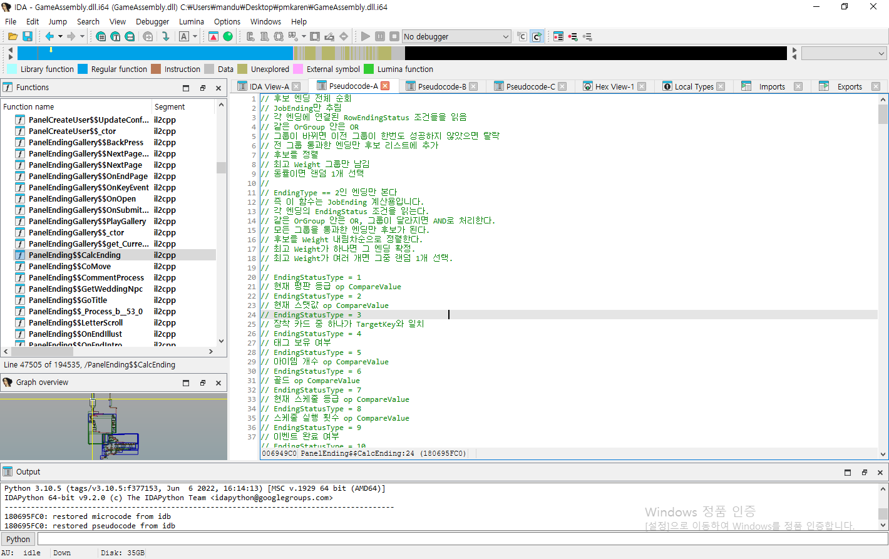
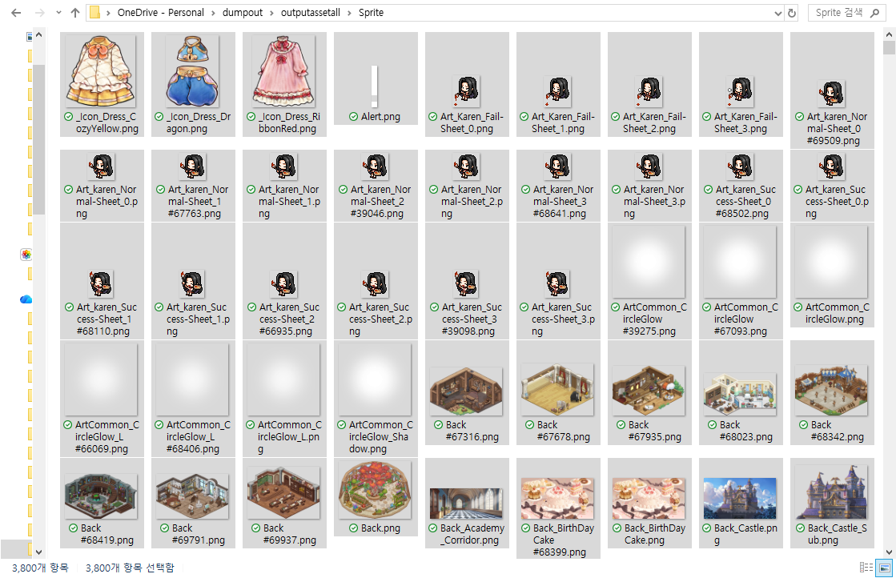

# 프린세스 메이커: 예언의 아이들, 데이터로 본 미완성의 흔적

# _파일을 뜯다가 17세 카렌 앞에서 멈춘 이야기_

## 들어가며

작년 연말, `프린세스 메이커: 예언의 아이들`을 둘러싼 먹튀 논란이 불거졌다. 갑작스럽게 회사의 경영난과 더불어 운영 중단 소식이 들려왔고, 프로젝트의 행방은 묘연해졌다.

처음 이 프로젝트가 `프린세스 메이커 : 카렌`이라는 이름으로 텀블벅에 올라왔을 때, 그 누가 이렇게 될 거라고 상상이나 했을까. 텀블벅 후원은 매우 성공적이었다. 최종 후원 금액은 351,524,000원, 후원자는 4,837명, 달성률은 351%였다.[^tumblbug] 게임메카도 이 작품이 목표 금액을 크게 넘겼고, 한때 정식 시리즈의 주인공이 될 뻔했던 카렌을 다시 전면에 세웠다는 점을 짚었다.[^gamemeca-title] 모두가 기대감에 들떴다.

프린세스 메이커의 오랜 팬으로서 나도 꽤나 기대하고 있었다. 선공개된 일러스트를 본 후 기대감에 들떠 디자드라는 회사도 찾아봤고, 원작자를 찾아가 권리 계약을 맺었다는 이야기도 눈여겨봤다. 원작 일러스트레이터의 사인까지 펀딩 상품으로 기획한 걸 보고는 최소한 애정 없이 시작한 프로젝트는 아니라고 느꼈다.

시간이 지나고, 2025년 7월, 얼리액세스판이 스팀에 공개됐다.

스팀 상점에는 얼리액세스 범위가 **4년 분량, 공략 가능 캐릭터 2명, 약 20개 엔딩**으로 적혀 있었다. 정식판 목표는 **8년 분량, 공략 가능 캐릭터 8명, 50개 이상 엔딩**이었다.[^steam-store] 사람들의 기대만큼은 아니지만 아직 얼리액세스니까, 차차 업데이트될 콘텐츠에 설렘을 품었다.

그런데 막상 뚜껑을 열어보니, 딸과의 생활은 너무 빨리 끝났다.

내 딸 카렌은 14세가 되자마자 “독립하겠다”고 집을 나갔다. 오래 기다린 딸과 보낼 시간을 고대했는데, 인사도 제대로 하기 전에 문 열고 나가는 느낌이었다. 팬으로서는 황당했고, 플레이어로서는 허전했다. 아니, 벌써? 라는 말이 먼저 나왔다.

스팀 리뷰를 둘러보니 다른 이들도 나와 비슷한 편이었다. 2026년 4월 26일 기준, 게임 평가는 **Mixed**로, 구매자 리뷰 321개 중 긍정적인 반응은 57%였다.[^steam-store] 긍정 리뷰는 기본적인 육성 흐름이 살아 있다는 점을 평가했고, 부정 리뷰는 가격 대비 부족한 볼륨, 지연된 업데이트, 앞으로의 완성 가능성에 대한 불안을 지적했다.[^steam-reviews] 이런저런 이유로 업데이트가 차일피일 미루어지더니, 얼리액세스 출시 후 공백이 쭉 길어지면서 “이거 진짜 괜찮은 거 맞나?”하는 사람들의 소리가 점점 커졌다. 결국 디자드는 대규모 구조조정과 개발팀 전원 퇴사로 프로젝트를 자체적으로 이어가기 어려운 상태가 됐고, 개발은 외부 회사로 이관되는 절차를 밟게 됐다. 그에 따라 텀블벅 후원자들을 향한 굿즈 발송도 늦어졌다.

게임이 가벼운 건 맞다. 사람들의 불안감도 이해된다. 그렇다면 이 게임은 정말 처음부터 의도적으로 소비자를 기만하려는 프로젝트였을까? 나 역시도 궁금했다. 그래서 나는 플레이 감상만으로 판단하기 전에, 이 게임 안에 실제로 무엇이 남아 있는지부터 확인해보기로 했다.

## 플레이보다 분석을 먼저 해버렸다

보통의 게이머들은 새 게임이 나오면 일단 플레이부터 하겠지만, 나는 딸이 너무 반가운 나머지 내부 데이터부터 열어봤다. 지금 생각하면 나도 좀 웃기다. 게임이 처음 스팀에 올라온 날, 카렌을 보러 가는 대신 ILSpy를 통해 함수부터 확인했으니.

어린 시절 프린세스 메이커를 하고 자란 나는, 프린세스 메이커 에디터를 만들었던 이들에게 경외감을 갖고 있었다. DOS 시절에는 디버깅이 지금처럼 쉽지 않았고 컴퓨터 박사라는 말이 아깝지 않을 정도로 프로그램에 대한 지식이 있어야 가능했기 때문이다. 많고 많은 기술 중에 하필 리버싱을 전공으로 택한 것도, 어린 시절 에디터 화면 구석에서 자신을 '컴퓨터 박사'라 칭하던 제작자의 멋진 모습에 매료되어서였을지 모른다.

나 역시 타인에게 게임 플레이에 도움을 줄 수 있는 프로그램을 만들 날을 기다려왔는데 마침 이렇게 기회가 온 것이다. 프린세스 메이커의 신작이 나왔고, 어쩌면 세계 최초의 신작 에디터라니, 그 타이틀을 어떻게 참고 배긴단 말인가? 그 마음으로, Il2CppDumper를 통해 게임 속 딸을 키우기도 전에 딸의 엔딩 계산 함수부터 찾아봤다.



이미 ILSpy를 통해 기본적인 함수 네이밍은 확인했으니, 그 다음에는 AssetStudio로 에셋을 뽑았다. BepInEx로 런타임 상태를 보고, Il2CppDumper와 IDA로 함수를 복원했다. 엔딩 쪽은 딱 봐도 엔딩 관련 함수로 보이는 `PanelEnding__CalcEnding`을 따라서 하나하나 코드를 분석했다. 텍스트 테이블과 세이브 파일은 바로 읽히지 않아서 `decode_text_assets.py`, `decode_savedata.py` 같은 스크립트를 따로 만들었다. 워낙 복호화가 쉬워서 요즘 게임에는 잘 안 쓰이는 편인데, 특이하게 XOR이랑 MessagePack으로 간단한 암호화를 걸어뒀다.정상적으로 세이브 파일 데이터가 불러와지는 걸 확인한 후에서야 딸과의 삶을 즐길 수 있었다. 나중에 엔딩 조건 가이드를 제대로 정리하려면, 일단 직접 엔딩을 보며 데이터와 대조할 기준점이 필요했기 때문이다. 만반의 준비를 하고 딸과의 삶을 기대하고 1회차를 플레이했다. 오래전부터 보고 싶었던 딸이었다. 이제는 사라진 이름이 되어버린, 다이도우지 카렌이라는 검은 머리 딸. 프린세스 메이커 Q 이후로 얼마 만에 그 예쁜 얼굴을 보는건지!

그런데... 14세가 되자마자 독립하겠다고 나간 딸의 모습을 봤을 때는 심히 당황스러웠다. 스포일러를 피하려고 게임을 하다 보니, 스팀 리뷰에 적힌 14세까지만 플레이 가능하다는 사실조차 모르고 시작했기 때문이다. 여기서 끝난다고? 이렇게? 갑자기?

황당한 조기 종료였지만, 내부 시스템은 굴러가고 있었다. 커서 백수가 될 거라던 점쟁이의 예언과 달리 내 딸은 직업 엔딩을 맞이했고, 비록 14세의 이른 독립이었지만 프린세스 메이커 2처럼 결혼 엔딩까지 따로 정산되어 나왔다. 이때 점쟁이의 예언과 실제 엔딩 계산은 별도 로직일 가능성이 높다고 봤다. 예언은 플레이 중 보여주는 힌트에 가깝고, 최종 엔딩은 별도의 조건 계산을 거쳐 정산될 테니까.

이쯤 되니 그냥 넘기기에는 아까웠다. 분석한 코드와 1회차 플레이로 확인한 결과를 대조하면서, 먼저 엔딩 조건 가이드를 정리했다. `PanelEnding__CalcEnding`에서 확인한 조건이 실제 플레이 결과와 어떻게 맞물리는지 확인하고, 어떤 능력치와 상태값이 어떤 엔딩으로 이어지는지 하나씩 정리해 나갔다.

그 다음에는 앞서 만들어 둔 세이브 복호화 스크립트를 바탕으로 세이브 에디터를 만들었다. 세이브 안에 남아 있는 딸의 능력치, 이벤트 상태, 파트너 호감도 같은 값을 직접 확인하고 수정할 수 있으면, 이 짧은 얼리액세스 빌드 안에서도 플레이어가 더 많은 경우의 수를 실험해볼 수 있을 거라고 생각했다. 그렇게 만든 결과물이 지금 공개해둔 세이브 에디터[^save-editor]와 엔딩 조건 가이드[^ending-guide]다. 어차피 딸을 제대로 키우려면 필요한 것들이었으니까.

배포를 끝낸 뒤에도 분석은 멈추지 않았다. 오히려 에디터를 고도화하고 실제 세이브 구조를 더 정확히 맞춰보는 과정에서, 게임 안쪽의 데이터가 더 눈에 들어오기 시작했다.

엔딩 직전의 세이브 파일을 다시 열었을 때 먼저 보인 건 `EventDic`, `PartnerDic`, `FestivalDic`, `ScheduleDataDic` 같이 딕셔너리로 추정되는 이름들이었다. 이벤트, 파트너, 축제, 스케줄 상태가 따로 저장되고 있었다. 플레이만 했을 때는 게임이 너무 금방 끝나서 내부도 대충 구현되어 있을 줄 알았는데, 세이브 구조는 의외로 꼬박꼬박 키가 나뉘어 있었다.

여기서 한 번 다르게 봤다. 이 게임, 플레이는 짧지만 뭔가 있긴 하구나.

## 데이터가 보여준 엔딩 스포일러

현재 `TableEnding`에서 실제 엔딩으로 잡히는 건 21개다. 직업 엔딩 19개, NPC와 이어지는 결혼 엔딩 2개. 얼리액세스 설명에 적힌 약 20개 엔딩과 얼추 비슷하다. 근데 그냥 거기서 끝났다면 리버싱 하는 재미가 없었겠지.

복호화한 `TableText`를 열면 아직 게임에서 볼 수 없는 이름들이 나온다.

```
Name_Ending_DemonKing = 마왕
Name_Ending_Princess = 프린세스
Name_Ending_Queen = 여왕
```

`Name_Ending_*` 키를 확인해보니 58개가 정의되어 있고, 한국어로 된 엔딩 이름까지 들어 있었다. 마왕. 프린세스. 여왕. 내 딸이 어떤 엔딩을 맞이하고, 어떻게 살아갈지 미리 알려준 예언서 같았다.

`TableText`에도 현재 엔딩 21개보다 훨씬 많은 엔딩 이름이 남아 있었다. 혹시 다 구현되지 않은 엔딩이어도 남아 있는 대사가 있을까 싶어서 더 찾아봤지만, 아쉽게도 그에 대응하는 엔딩 대사 본문은 존재하지 않았다. 대신 현재 직업 엔딩 19개에는 대사와 후일담 편지 계열 텍스트가 꽤 촘촘하게 붙어 있었다. 그 외에 얼리액세스 더미 데이터에 남아 있는 엔딩은 다음과 같다.

<details>
<summary>얼리액세스 더미 데이터에 남아 있는 엔딩 이름 전체 보기</summary>

```
Name_Ending_Adventurer = 모험가
Name_Ending_Assistant = 연구조교
Name_Ending_Bartender = 바텐더
Name_Ending_Blacksmith = 대장장이
Name_Ending_Breakingbad = 브레이킹배드
Name_Ending_Champion = 명예결투사
Name_Ending_Contractor = 청부업자
Name_Ending_Counterfeitartist = 위작예술가
Name_Ending_Curator = 박물관 학예사
Name_Ending_DemonKing = 마왕
Name_Ending_Diplomat = 외교관
Name_Ending_Femme = 팜므파탈
Name_Ending_FortuneTeller = 점술가
Name_Ending_General = 대장군
Name_Ending_Governess = 예법교사
Name_Ending_Humanhunter = 인간 사냥꾼
Name_Ending_Iconsculptor = 우상제작자
Name_Ending_Judge = 재판관
Name_Ending_Logistics = 물류 관리인
Name_Ending_Magepainter = 마도화가
Name_Ending_Magicknight = 마법검사
Name_Ending_MagicTutor = 마법 사범
Name_Ending_Mysteriousthief = 괴도
Name_Ending_Preceptor = 병영 지도 교사
Name_Ending_Princess = 프린세스
Name_Ending_Queen = 여왕
Name_Ending_Raapresident = 왕립예술학회장
Name_Ending_Rich = 투자계의 거물
Name_Ending_Royalwizard = 왕궁마법사
Name_Ending_Scholar = 대도서관의 마법연구자
Name_Ending_Sting = 스팅
Name_Ending_Superstar = 메이드 카페의 슈퍼스타
Name_Ending_Sworddancer = 검의 무희
Name_Ending_Thegodfather = 뒷골목의제왕
Name_Ending_Unloadingmanager = 하역관리자
Name_Ending_Visionarydirector = 비전 연출가
Name_Ending_Wanderer = 무책임한 방랑자
```
</details>

최근 텀블벅 후기의 실물 굿즈 사진을 확인하면 후원자에게 전달된 굿즈 안에는 딸의 엔딩 이미지로 보이는 일러스트들이 일부 포함되어 있다.[^tumblbug-review] 굿즈 이미지가 실제 게임 구현 계획과 그대로 일치한다고 말할 수는 없지만, 그래도 게임 안에는 엔딩 이름 정도는 구현 되어 있고, 게임 밖에는 엔딩으로 보이는 이미지가 존재하고 있다.

## 카렌, 17세

엔딩 이름 목록만으로는 조금 부족하다 싶어서 이런저런 에셋들을 더 뒤적이다가, 한눈에 시선을 사로잡는 파일을 발견했다. `karen_17_body`라는 이름의 에셋이다. 그 옆에는 `karen_17_hair`가 있었고, `Dress_Basic_17`도 있었다.

처음엔 잘못 본 줄 알았다. 왜냐면 중간 단계인 `karen_16_body` 같은 에셋은 없었으니까. 다시 봤다. 확실하게 17이었다. 실행해서 확인해보니 내가 생각한 게 맞다. 그리고 표정 파일이 나왔다. `karen_17_face_*`. 한두 개가 아니었다. `MonoBehaviour` 쪽에는 `Karen_17` 객체도 따로 있었다.

17세의 카렌을 이루는 데 필요한 파일들이 수십 개가 쌓여있다니.

그 파일들을 보고 잠깐 아무것도 안 했다. 그냥 목록을 보고 있었다. 묘하게 웃기기도 하고, 좀 짠하기도 했다. 게임에서는 14세가 되자마자 집을 나가 버린 딸인데, 게임 속을 들여다보니, 아직 보지 못한 내 딸의 17세 모습이 남아 있었다.

게임을 해본 플레이어는 알겠지만, 게임에서 보이는 카렌의 표정 변화와 동작은 꽤 자연스럽다. 데이터를 열어보면 그 자연스러움을 만들기 위한 표정, 머리카락, 몸통, 의상, 행동 객체들이 각각 따로 남아 있다. 비록 데이터지만, 이 파편으로나마 카렌을 만드는 제작진들이 얼마나 카렌을 아끼고 있는지는 느껴졌다. 근데, 그런 카렌이 어쩌다가 17세의 모습만 남아버린 건지 의문도 든다.

17세 에셋이 있다고 해서 이미 17세 플레이 구간이 모두 완성되어 있지는 않을 것이다. 바캉스 테이블을 보면 14세 이후 항목이 모두 13세 프리팹을 가리키는 부분이 존재하지만, 이건 현재 빌드가 14세에 엔딩이 나오도록 잘려 있으니, 실행 안정성을 위해 임시로 채워 넣었을 거라는 짐작을 할 수 있다.

그래서 17세 카렌의 흔적은 그냥 넘기기 어려웠다. 플레이할 때는 스탠딩 일러스트 한 장처럼 보일 수도 있지만, 데이터를 열어보면 그 그림 하나를 세우기 위해 표정, 머리카락, 몸통, 의상, 행동 객체가 따로 나뉘어 있었다. 누군가는 카렌이 17세까지 자란 모습을 실제로 만들고 있었다. 그걸 보고 나니, 이 게임을 처음부터 비워둔 사기극이라고만 말하기는 어려웠다.

## 숲의 일족, 그리고 남겨진 미래의 잠재적 배우자들

카렌의 흔적을 보고 나니 다른 데이터들도 눈에 들어오기 시작했다. 직업 엔딩에 대한 내용을 봤으니 내 딸의 잠재적 배우자들의 흔적을 더 찾아볼 수 있지 않을까 싶어서 연관된 파일들을 뒤져봤다. 현재 얼리액세스 빌드에서 실제로 공략할 수 있는 NPC는 숲의 일족인 올리아와 클리비아뿐이다. 숲의 일족은 `D_ForestMale_`*, `D_ForestFemale_`* 이런 네이밍을 한 에셋들로 이루어져 있는데, 생각보다 분량이 꽤 됐다.

중복된 파일을 걷어내고 세어본 숲의 일족 관련 스크립트만 무려 58개에 달했다. 첫 만남부터 호감도에 따른 에피소드, 단계별 선물 반응, 프로포즈와 결혼식, 그리고 직업 연계 대사까지. 연애 시뮬레이션 게임 만큼은 아니지만, 그들이 내 딸의 배우자가 되는 길을 따라가보면 숲의 일족 루트는 꽤 차곡차곡 채워져 있었다.

| 진행 단계 | 관련 데이터 키 | 실제 연결된 연출 및 기능 |
| :--- | :--- | :--- |
| **첫 만남** | `D_Forest~_Encounter`, `FirstEpisode` | 단순 조우를 넘어선 전용 관계 루트 진입 이벤트 |
| **호감도 진행** | `D_Forest~_Episode1~6`, `Greeting` | 호감도 상승에 따라 순차적으로 열리는 스토리 에피소드 |
| **선물 반응** | `GiftDeny`, `GiftNormal`, `GiftGood`, `GiftGreat` | 선물의 가치에 따라 갈라지는 4단계 반응 |
| **선호도 정보** | `FavoriteItem`, `FavoriteArea`, `Favor_Amulet` | 좋아하는 아이템, 장소, 호감도 보조 시스템 |
| **직업/활동 연계** | 여성: `Woodworking` 계열 등 / 남성: `Alchemy` 계열 등 | 연애 이벤트와 특정 직업/활동 콘텐츠의 긴밀한 연동 |
| **고백 및 결혼** | `D_Forest~_Proposal`, `Wedding` | 프로포즈와 결혼식 연출을 위한 독립 이벤트 |
| **최종 엔딩** | `Ending_Couple_Forest~`, 일러스트 및 썸네일 | 조건을 만족했을 때 도달하는 결혼 엔딩 결과물 |

문득 다른 NPC들의 상태는 어떨지 궁금해졌다. 파트너 NPC 설정 테이블인 `TableNpcPartner`를 열어보니, 거기엔 숲의 일족 말고도 수인, 마족, 용족까지 남녀 한 쌍씩 총 8명의 자리가 나란히 정의되어 있었다. 호감도 상태나 선물 반응을 담을 칸도 8명분으로 똑같이 잡혀 있었다. 시스템의 시작점은 분명 8명 모두를 향해 있었던 모양이다.

`TableText` 안을 조금 더 깊게 파고 들어가자, 숲의 일족이 아닌 다른 종족들의 텍스트 파편들이 조금씩 모습을 드러냈다.

| 구분 | 확인된 후보 수 | 주요 확인 내용 |
| :--- | :---: | :--- |
| **수인** | 11개 | 마비안 지역, 수인족 생활 풍문, 파트너 프로필 정보 |
| **마족** | 26개 | 아가레스 첫 만남 이벤트, 바르제 호수, 마인족 생활 풍문 |
| **용족** | 28개 | 아즈란 산맥, 용족 생활 풍문, 파트너 프로필 정보 |

이 중 마족 남성 파트너인 '아가레스' 쪽 데이터는 제법 구체적인 형태를 갖추고 있었다. `Event_Demon_Male_First_1~14`라는 이름의 파일에는 그와의 첫 만남 시퀀스가 고스란히 남아 있었다. 복도에서 금색 목걸이를 주워 준 딸과, 말없이 고개를 끄덕이다가 수줍게 통성명을 건네는 아가레스의 짧은 대화. 그리고 문단의 마지막은 "아가레스의 호감도가 상승하였습니다"라는 명확한 시스템 문구로 끝이 난다.

용족 남성인 '그라실리스' 역시 짧지만 묘한 흔적을 남겼다. `Talk_Event_2`를 보면 아즈란 산맥에서 그를 만났고, 만난 지 얼마 되지도 않았는데 냅다 반지를 주었다는 황당하면서도 귀여운 대사가 적혀 있다. 목걸이만 주워 줘도 호감도가 상승하거나, 만난 지 얼마 안 된 이에게 반지를 받는 걸 보면 역시 카렌은 아이들의 눈으로 봐도 예쁜 편이 분명하다.

이외에도 수인, 마족, 용족 데이터에는 마을 쉼터나 자유 행동 시간에 들을 수 있는 풍문성 대사(`Flow_FreeTime_Explore*`)들이 함께 묶여 있었다.

> "수인족의 침대는 정말 폭신폭신하대! 나도 한번 누워보고 싶어." (마비안 지역 풍문)  "마인족은 자기 전에 기도를 한대. 기도를 하고 자면 좋은 꿈을 꿀 수 있는 걸까?" (바르제 호수 풍문)  "용족의 침대는 보석으로 되어 있는 게 많대! 근데 난 딱딱할 것 같아서 조금 별로야." (아즈란 산맥 풍문)

- 여담인데, 위 풍문 대사에 나오는 마인족은 마족을 의미하는 것 같다. 시스템상에 표기되는 종족명은 데이터로 확인했을 때 확실하게 마족이 맞다. 용어가 완전히 정리되기 전의 흔적인지, 혹은 대사 안에서만 쓰는 별도 표현인지는 알 수 없지만. 이것도 정식 발매가 되면 통일되겠지?

이 대사들을 당장 결혼 엔딩 루트의 직접적인 증거로 볼 수는 없다. 보통 판타지물에서 우리가 아는 것처럼 드래곤은 보석을 좋아한다는 얘기가 있듯이, 아직 설정이 다 풀리지 않은 종족들의 지역과 생활 설정을 보여주는 배경 텍스트에 가깝다. 그래도 '마비안', '바르제 호수', '아즈란 산맥'처럼 구체적인 지역명이 파트너의 이름과 함께 묶여 있는 것을 보면, 제작진이 단순히 자리만 만들어 둔 게 아니라 이들의 세계관과 생활권까지 어느 정도 머릿속에 그려두고 있었다는 생각이 든다.

이런 데이터를 마주할 때가 제일 마음이 복잡해진다. 어떤 캐릭터는 내 딸의 배우자가 되어 행복하게 살지만, 어떤 캐릭터는 겨우 첫 만남의 조각이나 소문으로만 맴돌고 있다. 이마저도 실제 게임 내에서 플레이로 잡히는 부분은 아주 작은 단면일 뿐이다. 선공개된 일러스트를 통해 그들의 모습을 확인할 수 있지만 게임에서는 별다른 만남의 흔적조차 찾을 수 없다.

## 그래서 정말 이 게임은 "먹튀"일까?

그래서 먹튀냐고 묻는다면, 나는 이렇게 답하겠다.

`프린세스 메이커: 예언의 아이들`은 먹튀용으로 기획된 빈 껍데기라기보다, 너무 이른 시점에 문을 연 미완성 프로젝트다.

지금까지 분석한 내부 데이터와 이후 이관 과정을 함께 놓고 보면, 적어도 이 프로젝트가 처음부터 플레이어를 속이기 위해 급조된 빈 껍데기였다고 보기는 어렵다. 이후 프로젝트가 외부 회사로 이관되고, 개발을 이어가겠다는 공지가 나온 점도 이 판단에 영향을 줬다. 개발 의지가 곧 완성을 보장할 수는 없다. 다만 내가 본 데이터가 단순히 버려진 잔해가 아니라, 아직 이어질 수 있는 작업물일 가능성은 조금 더 커졌다.



`sprite` 폴더 내부의 이미지 파일을 보면 개수만 해도 3800개이고, `Texture2D` 폴더에도 1400개 이상의 이미지가 존재한다. 저작권상 모든 에셋을 업로드할 수는 없지만, 이미지 에셋만 보더라도 제작진들이 살아 움직이는 카렌을 위해 얼마나 품을 들였을지 단번에 알 수 있는 숫자다. 원래 개발진이 그대로 이관되었다는 소식은, 이 프로젝트가 완전히 버려지지 않았을 가능성에 더 기대를 걸고 싶게 만든다.

그렇다고 지금의 이 결과물이 괜찮다는 뜻은 아니다. 유저는 리소스를 산 게 아니라 게임을 샀다. 얼리액세스라도 가격과 약속, 업데이트 계획, 소통은 따라와야 한다. 기껏 딸을 위해 한 달 스케줄을 세웠는데 무턱대고 수업을 빼먹거나 가출을 해버리면 플레이어 입장에서 곤란하고 난감하듯이, 자식이 아무리 예뻐도 학교 성적표(인게임 결과물)는 낙제점이었다. 플레이어가 경험할 수 있는 결과물은 부족했고, 업데이트는 약속된 방향으로 이어지지 못했다. 의도가 사기였는지와 별개로, 플레이어 입장에서는 기만처럼 느껴질 수밖에 없었다.

한편으로는 그래서 더 씁쓸하다. 아무것도 없었다면 기대도 덜 했을 텐데. 데이터 안에는 누군가 실제로 만들고 있던 흔적이 남아 있지만, 그 흔적은 실제 플레이어에게 와닿지 못했으니까.

## 그래도 나는 기다리겠다

카렌은 오랫동안 프린세스 메이커 팬들에게 비운의 딸이었다. 원래 프린세스 메이커 4의 주인공으로 기획됐지만 프로젝트가 엎어지면서 한 번 사라졌고, 이번에도 완성되지 못한 채 또 남겨졌다.

먹튀 논란으로 기사가 나고, 누군가는 커뮤니티에서 사기당했다며 환불을 요구한다. 하지만 반대로, 나는 이 일련의 미완성된 시공 현장을 보고 좀 더 기다리기로 했다. 만약 이 프로젝트가 처음부터 유저들을 속이기 위해 급조된 빈 껍데기였다면, 시스템 구조 역시 당장 눈앞에 돌아가게만 만드는 날림 공사로 가득했을 것이다. 그렇게 망가진 코드는 나중에 다시 고치거나 콘텐츠를 덧붙이는 것보다, 처음부터 다시 만드는 편이 나을 때가 많다.

내가 본 데이터 속 이 게임은 정반대였다. 게임 내부에 남아 있는 텍스트와 이미지 에셋만 봐도 적지 않은 시간을 투자했을 거라는 생각이 든다. 데이터 구조 역시 마찬가지다. 아직 남아 있는 8명분의 파트너 슬롯, 체계적인 이벤트 분류, 복잡한 미래 분기를 감당할 수 있도록 설계된 코드는 지금도 주인을 기다리듯 멀쩡히 살아 숨 쉬고 있다. 기술적으로 볼 때, 모든 게 완벽하지는 않아도, 적어도 누군가 의지와 여력을 가지고 다시 뛰어든다면 알맹이를 채워 넣을 수 있는 자리들은 남아 있었다.

비록 지금은 공사가 멈춘 차가운 콘크리트 건물처럼 남겨졌지만, 그 안에는 아직 방이 될 자리, 복도가 될 자리, 언젠가 불이 켜질 자리들이 남아 있었다. 그래서 나는 이 게임을 완전히 놓아버리지 못한다.

앞날은 모른다. 멀쩡히 게임이 완성되기까지 얼마나 더 걸릴지도 모르고, 과정이 순탄치 않을 수도 있다. 그래도 나는 이 게임을 당장 공허한 실패작으로만 남기고 싶지는 않다. 지금은 조각난 데이터와 멈춘 스케줄로 남아 있지만, 언젠가 이 작업의 조각들이 다시 이어져 17세 카렌이 18세를 맞고, 끝내 여왕이라는 자리까지 걸어가는 날이 왔으면 한다. 그때까지 나는 팬으로서, 그리고 엄마의 마음으로 조금 더 기다려보려 한다.

PS. 딸아, 엄마는 프린세스 메이커Q도 견디면서 20년 넘게 너를 기다려 왔단다. 조금 더 걸려도 좋으니, 이번에는 제대로 얼굴 좀 비춰다오.

## 참고 링크

[^steam-store]: _Princess Maker : Children of Revelation_ Steam 상점 페이지. 출시일, 리뷰 요약, 리뷰 수, 얼리액세스 범위 확인일: 2026-04-26. https://store.steampowered.com/app/3438810/Princess_Maker__Children_of_Revelation/

[^steam-reviews]: _Princess Maker : Children of Revelation_ Steam 커뮤니티 리뷰. 상위 긍정/부정 리뷰의 분위기와 초점 확인일: 2026-04-26. https://steamcommunity.com/app/3438810/reviews/?browsefilter=toprated

[^tumblbug]: 텀블벅 프로젝트 페이지, _프린세스 메이커 : 카렌_. 펀딩 금액, 후원자 수, 달성률 확인일: 2026-04-26. https://tumblbug.com/princessmaker

[^gamemeca-title]: 게임메카 기사 「프린세스 메이커: 카렌, 정식 게임명 ‘예언의 아이들’」, 2025-02-18. https://www.gamemeca.com/view.php?gid=1758466

[^save-editor]: 필자가 제작·배포한 `프린세스 메이커: 예언의 아이들` 세이브 에디터. https://princessmakerkaren-editor-retro.pages.dev/

[^ending-guide]: 필자가 제작·배포한 `프린세스 메이커: 예언의 아이들` 엔딩 조건 가이드. https://princessmakerkaren-ending.pages.dev/

[^tumblbug-review]: 텀블벅 `프린세스 메이커 : 카렌` 후기 및 상세 후기 페이지. 후원자 실물 굿즈 사진과 엔딩 이미지로 보이는 일러스트 확인용. https://tumblbug.com/princessmaker/community/review / https://tumblbug.com/review/245938/detail

---


# Princess Maker: Children of Revelation — Traces of an Unfinished Game, Seen Through Its Data

_A story about opening the files and stopping at seventeen-year-old Karen_

## Introduction

Late last year, controversy broke out around `Princess Maker: Children of Revelation`. People began calling it a “take-the-money-and-run” project. News arrived abruptly: the company was in financial trouble, operations were being suspended, and the future of the project became unclear.

When this project first appeared on Tumblbug under the title `Princess Maker: Karen`, who could have imagined it would come to this? The crowdfunding campaign itself was a major success. It raised a total of KRW 351,524,000 from 4,837 backers, reaching 351% of its goal.[^en-tumblbug] GameMeca also noted that the project had far exceeded its target amount and brought Karen, once planned as the protagonist of a mainline entry, back to the front of the series.[^en-gamemeca-title] Everyone was excited.

As a longtime Princess Maker fan, I was excited too. After seeing the early illustrations, I looked up the company Dzard and paid attention to the story that they had visited the original creator and secured the rights. When I saw that they had even planned a signed item from the original illustrator as part of the funding rewards, I felt that this was not a project that had begun without affection.

Time passed, and in July 2025, the Early Access version was released on Steam.

The Steam store page described the Early Access scope as **four years of gameplay, two romanceable characters, and roughly twenty endings**. The stated goal for the full version was **eight years of gameplay, eight romanceable characters, and more than fifty endings**.[^en-steam-store] It was not everything people had hoped for, but this was still Early Access. I looked forward to the content that would arrive through future updates.

But once I opened the lid, life with my daughter ended far too quickly.

My daughter Karen left home the moment she turned fourteen, saying she would “become independent.” I had waited so long to spend time with her, but it felt as if she opened the door and left before I could even say goodbye properly. As a fan, I was baffled. As a player, I felt empty. My first reaction was simply: already?

Looking through the Steam reviews, I found that many others seemed to feel much the same way. As of April 26, 2026, the game’s review status was **Mixed**, with 57% positive reviews among 321 purchaser reviews.[^en-steam-store] Positive reviews appreciated that the basic raising-sim loop was still present, while negative reviews pointed to the thin volume relative to the price, delayed updates, and anxiety over whether the game would ever be completed.[^en-steam-reviews] Updates kept being delayed for various reasons, and as the silence after the Early Access release grew longer, more people started asking, “Is this really going to be okay?” In the end, Dzard underwent major restructuring, the entire development team resigned, and the project entered a process of being transferred to an external company. The delivery of physical rewards to Tumblbug backers was delayed as well.

The game is undeniably light. I understand why people were uneasy. But was this game truly designed from the beginning as a deliberate attempt to deceive consumers? I wanted to know too. So before judging it only by my play experience, I decided to look inside the game and see what was actually there.

## I Ended Up Analyzing It Before Playing It

Most players start by playing a new game when it comes out. I, however, was so happy to see my daughter again that I opened the internal data first. Looking back, even I think that was a little ridiculous. On the day the game first appeared on Steam, I went to inspect functions through ILSpy instead of going to meet Karen.

Having grown up playing Princess Maker, I had always admired the people who made Princess Maker editors. In the DOS era, debugging was not as easy as it is now, and making such tools required enough programming knowledge that the phrase “computer wizard” did not feel exaggerated. Perhaps the reason I ended up specializing in reverse engineering, out of all possible technical fields, was that I was once captivated by the image of an editor author calling themselves a “computer wizard” in the corner of an editor screen.

I had long wanted to create a program that could help other people enjoy a game. Then this opportunity appeared. A new Princess Maker game had been released, and perhaps I could make the world’s first editor for that new title. How could I possibly resist that? With that thought, I used Il2CppDumper to look for my daughter’s ending calculation function before I had even raised her in-game.


Since I had already checked the basic function names through ILSpy, I next extracted the assets with AssetStudio. I inspected runtime state with BepInEx and reconstructed functions with Il2CppDumper and IDA. For the ending logic, I followed `PanelEnding__CalcEnding`, a function that was obviously related to endings, and analyzed the code step by step. The text tables and save files were not immediately readable, so I wrote separate scripts such as `decode_text_assets.py` and `decode_savedata.py`. The decryption itself was simple enough that modern games rarely rely on this kind of approach, but interestingly, the game used a lightweight combination of XOR and MessagePack.

Only after confirming that the save data could be loaded correctly did I finally begin enjoying life with my daughter. If I wanted to build a proper ending condition guide later, I first needed a reference point by actually seeing endings and comparing them against the data. Fully prepared, I started my first playthrough, looking forward to living with my daughter. She was the daughter I had wanted to see for so long: the black-haired daughter named Daidouji Karen, now a name that had almost disappeared. How long had it been since Princess Maker Q since I last saw that pretty face?

But when I saw my daughter declare independence and leave the moment she turned fourteen, I was genuinely stunned. I had tried to avoid spoilers while playing, so I did not even know about the Steam review comments saying that the game was only playable until age fourteen. It ends here? Like this? All of a sudden?

The abrupt early ending was absurd, but the internal systems were still working. Contrary to the fortune teller’s prediction that my daughter would grow up unemployed, she reached an actual career ending. And even though her independence came at the unusually early age of fourteen, the game separately calculated marriage endings in a way reminiscent of Princess Maker 2. At that point, I suspected that the fortune teller’s prediction and the actual ending calculation were handled by separate logic. The prediction seemed more like an in-game hint, while the final ending would be determined through a separate set of conditions.

By then, it felt like a waste to just move on. I compared the code I had analyzed against the results of my first playthrough and began organizing an ending condition guide. I checked how the conditions found in `PanelEnding__CalcEnding` matched actual play results, then documented which stats and state values led to which endings.

Next, I built a save editor based on the save decryption script I had already written. I thought that if players could directly view and modify values such as Karen’s stats, event states, and partner affection stored in the save file, they would be able to test more possibilities even within this short Early Access build. The result is the save editor[^en-save-editor] and ending condition guide[^en-ending-guide] that I have now made public. After all, they were the tools I needed if I wanted to raise my daughter properly.

Even after publishing them, the analysis did not stop. In fact, as I improved the editor and tried to match the real save structure more accurately, the game’s internal data began to stand out even more.

When I reopened a save file from just before the ending, the first things I noticed were names that appeared to be dictionaries, such as `EventDic`, `PartnerDic`, `FestivalDic`, and `ScheduleDataDic`. Event states, partner states, festival states, and schedule states were being saved separately. While playing, the game had ended so quickly that I assumed the internals would also be roughly assembled. But the save structure was more carefully divided into keys than I expected.

That made me look at the game differently. The playable portion may be short, but there is something here.

## Ending Spoilers Revealed by the Data

At present, `TableEnding` contains 21 endings that are actually treated as endings: 19 career endings and two marriage endings with NPCs. That roughly matches the “about twenty endings” described for Early Access. But if things had ended there, reverse engineering it would not have been very fun.

When I opened the decrypted `TableText`, I found names that cannot yet be seen in the game.

```
Name_Ending_DemonKing = 마왕
Name_Ending_Princess = 프린세스
Name_Ending_Queen = 여왕
```

Looking through the `Name_Ending_*` keys, I found 58 defined entries, including Korean ending names. Demon King. Princess. Queen. It felt like a book of prophecy quietly revealing what endings my daughter might eventually reach and how she might live.

`TableText` contained far more ending names than the 21 currently available endings. I kept digging, wondering whether there might also be dialogue for endings that had not yet been implemented. Unfortunately, there were no corresponding ending dialogue bodies for those entries. However, the 19 current career endings did have a fairly dense set of dialogue and epilogue-letter style text attached to them. The additional ending names left in the Early Access dummy data are as follows.

<details>
<summary>View the full list of ending names remaining in the Early Access dummy data</summary>

```
Name_Ending_Adventurer = 모험가
Name_Ending_Assistant = 연구조교
Name_Ending_Bartender = 바텐더
Name_Ending_Blacksmith = 대장장이
Name_Ending_Breakingbad = 브레이킹배드
Name_Ending_Champion = 명예결투사
Name_Ending_Contractor = 청부업자
Name_Ending_Counterfeitartist = 위작예술가
Name_Ending_Curator = 박물관 학예사
Name_Ending_DemonKing = 마왕
Name_Ending_Diplomat = 외교관
Name_Ending_Femme = 팜므파탈
Name_Ending_FortuneTeller = 점술가
Name_Ending_General = 대장군
Name_Ending_Governess = 예법교사
Name_Ending_Humanhunter = 인간 사냥꾼
Name_Ending_Iconsculptor = 우상제작자
Name_Ending_Judge = 재판관
Name_Ending_Logistics = 물류 관리인
Name_Ending_Magepainter = 마도화가
Name_Ending_Magicknight = 마법검사
Name_Ending_MagicTutor = 마법 사범
Name_Ending_Mysteriousthief = 괴도
Name_Ending_Preceptor = 병영 지도 교사
Name_Ending_Princess = 프린세스
Name_Ending_Queen = 여왕
Name_Ending_Raapresident = 왕립예술학회장
Name_Ending_Rich = 투자계의 거물
Name_Ending_Royalwizard = 왕궁마법사
Name_Ending_Scholar = 대도서관의 마법연구자
Name_Ending_Sting = 스팅
Name_Ending_Superstar = 메이드 카페의 슈퍼스타
Name_Ending_Sworddancer = 검의 무희
Name_Ending_Thegodfather = 뒷골목의제왕
Name_Ending_Unloadingmanager = 하역관리자
Name_Ending_Visionarydirector = 비전 연출가
Name_Ending_Wanderer = 무책임한 방랑자
```
</details>

Recent photos of physical rewards posted in Tumblbug reviews show that some of the goods delivered to backers include illustrations that appear to be ending images of Karen.[^en-tumblbug-review] Of course, merchandise images do not necessarily map directly to what was planned for the implemented game. Still, within the game there are at least ending names, and outside the game there are images that appear to be related to those endings.

## Karen, Age 17

The list of ending names still felt like it was not quite enough, so I kept digging through various assets. Then I found a file that immediately caught my eye: an asset named `karen_17_body`. Next to it were `karen_17_hair` and `Dress_Basic_17`.

At first, I thought I had misread it. There were no intermediate assets such as `karen_16_body`. So I checked again. It was definitely 17. I ran the game and confirmed that my assumption was right. Then the facial expression files appeared: `karen_17_face_*`. There was not just one or two of them. Under `MonoBehaviour`, there was also a separate `Karen_17` object.

Dozens of files needed to construct seventeen-year-old Karen were sitting there.

For a moment, I did nothing after seeing them. I just stared at the list. It was strangely funny, and also a little heartbreaking. In the game, my daughter leaves home as soon as she turns fourteen. But when I looked inside the game, the seventeen-year-old version of my daughter—the one I had not yet been able to see—was still there.

Anyone who has played the game knows that Karen’s facial expressions and movements in-game feel fairly natural. When you open the data, you can see that the expressions, hair, body, clothing, and action objects that create that naturalness all exist as separate pieces. They may only be data, but even through those fragments I could feel how much care the developers had put into making Karen. At the same time, I could not help wondering how that Karen ended up leaving behind only the trace of her seventeen-year-old self.

The existence of seventeen-year-old assets does not mean that the full age-17 gameplay section was already complete. Looking at the vacation table, there are entries after age fourteen that all point to age-thirteen prefabs. Since the current build is cut so that the ending occurs at age fourteen, it is reasonable to suspect that those entries were temporarily filled in for runtime stability.

That is why the traces of seventeen-year-old Karen were difficult to dismiss. During normal play, she might look like a single standing illustration. But when you open the data, that one image is divided into facial expressions, hair, body, clothing, and action objects. Someone was actually building the version of Karen who would grow to seventeen. After seeing that, it became difficult to call this game a scam that had been empty from the beginning.

## The Forest Tribe, and the Potential Future Spouses Left Behind

After seeing the traces of Karen, other data started catching my attention too. Since I had already looked into career endings, I wondered whether I could find traces of my daughter’s potential spouses. So I went through related files. In the current Early Access build, the only NPCs who can actually be romanced are Olya and Clivia of the Forest Tribe. The Forest Tribe assets use names such as `D_ForestMale_`* and `D_ForestFemale_`*, and there was more of them than I expected.

After removing duplicates, I counted as many as 58 Forest Tribe-related script files. They covered the first meeting, affection-based episodes, tiered gift reactions, proposals and weddings, and even career-linked dialogue. This is not a full dating sim, of course, but if you follow the path that leads them to become my daughter’s spouse, the Forest Tribe route was built up quite methodically.

| Progression Stage | Related Data Keys | Connected Presentation and Functions |
| :--- | :--- | :--- |
| **First meeting** | `D_Forest~_Encounter`, `FirstEpisode` | A dedicated relationship-route entry event beyond a simple encounter |
| **Affection progression** | `D_Forest~_Episode1~6`, `Greeting` | Story episodes that open sequentially as affection increases |
| **Gift reactions** | `GiftDeny`, `GiftNormal`, `GiftGood`, `GiftGreat` | Four reaction tiers depending on gift value |
| **Preference data** | `FavoriteItem`, `FavoriteArea`, `Favor_Amulet` | Favorite items, favorite locations, and an affection-support system |
| **Career/activity linkage** | Female: `Woodworking` series, etc. / Male: `Alchemy` series, etc. | Close linkage between romance events and specific career/activity content |
| **Confession and marriage** | `D_Forest~_Proposal`, `Wedding` | Independent events for proposal and wedding scenes |
| **Final ending** | `Ending_Couple_Forest~`, illustrations and thumbnails | Marriage ending results reached when conditions are met |

Then I began to wonder about the state of the other NPCs. When I opened `TableNpcPartner`, the partner NPC configuration table, I found that it defined not only the Forest Tribe but also beastfolk, demons, and dragons—one male and one female each, for a total of eight slots. The fields for affection states and gift reactions were likewise prepared for all eight characters. The system’s starting point was clearly aimed at all eight of them.

Digging a little deeper into `TableText`, fragments of text for the non-Forest races began to appear.

| Category | Confirmed Candidate Count | Main Confirmed Content |
| :--- | :---: | :--- |
| **Beastfolk** | 11 | Mavian region, rumors about beastfolk life, partner profile information |
| **Demons** | 26 | Agares first-meeting event, Lake Barze, rumors about demon life |
| **Dragons** | 28 | Azran Mountains, rumors about dragon life, partner profile information |

Among these, the data for the male demon partner, Agares, had a fairly concrete form. Files named `Event_Demon_Male_First_1~14` preserved his first-meeting sequence. Karen picks up a gold necklace for him in a corridor; Agares nods silently, then shyly introduces himself. The passage ends with a clear system message: “Agares’s affection has increased.”

The male dragon, Gracilis, also left behind a short but oddly memorable trace. In `Talk_Event_2`, there is a cute and absurd line saying that Karen met him in the Azran Mountains and, despite barely knowing him, suddenly received a ring from him. If someone’s affection increases just because Karen picked up a necklace for them, or if someone gives her a ring shortly after meeting her, then Karen must clearly be beautiful even in the eyes of children.

The beastfolk, demon, and dragon data also included rumor-like lines (`Flow_FreeTime_Explore*`) that could presumably be heard in village rest areas or during free-action time.

> “They say beastfolk beds are really fluffy! I want to lie down on one someday.” (Mavian region rumor)  “They say the demonfolk pray before going to sleep. If you pray before bed, can you have good dreams?” (Lake Barze rumor)  “They say many dragon beds are made of jewels! But I think they’d be too hard, so I don’t really like the idea.” (Azran Mountains rumor)

- As an aside, the “demonfolk” term used in the rumor text above seems to refer to the demon race. Based on the data, the race name displayed by the system is definitely “demon.” It may be a trace left from before the terminology was fully standardized, or it may be a separate expression used only in dialogue. Perhaps it will be unified in the full release.

These lines cannot be treated as direct proof of marriage ending routes right now. Much like the common fantasy idea that dragons like jewels, they feel closer to background text showing the regions and lifestyles of races whose settings have not yet been fully revealed. Still, when concrete place names such as “Mavian,” “Lake Barze,” and “Azran Mountains” are tied to partner names, it suggests that the developers did more than simply reserve empty slots. They had at least partly imagined these characters’ worlds and living environments.

This is the kind of data that leaves me feeling most conflicted. Some characters can become my daughter’s spouse and live happily with her, while others linger only as fragments of a first meeting or rumors. Even that is only a tiny slice of what is actually playable in the current game. Their appearances can be seen through pre-released illustrations, but in the game itself there is barely any trace of meeting them.

## So, Is This Game Really a “Take-the-Money-and-Run” Project?

If someone asks whether this was a cash grab, my answer is this:

`Princess Maker: Children of Revelation` is less an empty shell designed for a take-the-money-and-run scheme, and more an unfinished project that opened its doors far too early.

When I look at the internal data I have analyzed so far alongside the later transfer process, it is difficult to conclude that this project was a hastily assembled empty shell meant to deceive players from the beginning. The announcement that the project would be transferred to an external company and that development would continue also affects that judgment. Development intent does not guarantee completion. Still, the data I saw made it a little more plausible that these were not merely abandoned remains, but work that might still be continued.


Inside the `sprite` folder alone, there are 3,800 image files, and the `Texture2D` folder contains more than 1,400 images. I cannot upload all of the assets for copyright reasons, but the number of image assets alone makes it immediately clear how much effort the developers put into making Karen feel alive. The news that the original developers were transferred along with the project also makes me want to believe a little more that this project has not been completely abandoned.

That does not mean the current result is acceptable. Users did not buy resources; they bought a game. Even in Early Access, price, promises, update plans, and communication matter. If I spend a month planning my daughter’s schedule only for her to skip class or run away without warning, it is frustrating and confusing from the player’s point of view. No matter how lovely the child is, the report card—the actual in-game result—was failing. The playable result available to players was lacking, and updates did not proceed in the promised direction. Regardless of whether the intent was fraudulent, it was inevitable that players would feel deceived.

That is also why the situation feels even more bitter. If there had been nothing there, I would not have expected as much. But inside the data, there are traces of something that someone was genuinely making, and those traces never reached the player in a meaningful way.

## Still, I Will Wait

For Princess Maker fans, Karen has long been an unlucky daughter. She was originally planned as the protagonist of Princess Maker 4, but disappeared once when that project collapsed. Now, once again, she has been left behind before reaching completion.

Articles have been written about the controversy, and some people in the community say they were scammed and demand refunds. I, on the other hand, have decided to wait a little longer after seeing this unfinished construction site. If this project had been an empty shell hastily assembled from the beginning to deceive users, its system structure would likely have been full of rushed work designed only to make what was immediately visible run somehow. Code broken in that way is often easier to rebuild from scratch than to repair and expand later.

The game I saw in the data was the opposite. Just looking at the text and image assets left inside the game, I could tell that a considerable amount of time had been invested. The data structure told the same story. The eight partner slots still present, the systematic event classification, and the code designed to handle complex future branches are all still there, as if waiting for someone to return to them. From a technical perspective, not everything is perfect. But if someone with the will and resources were to step back in, there were still places left where the substance could be filled in.

For now, it stands like a cold concrete building where construction has stopped. But inside it, there are still places that could become rooms, places that could become corridors, and places where lights might someday turn on. That is why I cannot quite let go of this game.

I do not know what lies ahead. I do not know how much longer it will take for the game to be completed properly, and the process may not be smooth. Even so, I do not want to leave this game behind as nothing more than an empty failure. Right now, it remains as broken data fragments and halted schedules. But I hope that one day those pieces will be joined again, that seventeen-year-old Karen will turn eighteen, and that she will eventually walk all the way to the throne as queen. Until then, I will wait a little longer—as a fan, and as her mother.

PS. My daughter, your mother has waited for you for more than twenty years, even enduring Princess Maker Q. It is all right if it takes a little longer, so please show us your face properly this time.

## References

[^en-steam-store]: _Princess Maker : Children of Revelation_ Steam store page. Release date, review summary, review count, and Early Access scope checked on 2026-04-26. https://store.steampowered.com/app/3438810/Princess_Maker__Children_of_Revelation/

[^en-steam-reviews]: _Princess Maker : Children of Revelation_ Steam community reviews. Checked the tone and focus of top positive and negative reviews on 2026-04-26. https://steamcommunity.com/app/3438810/reviews/?browsefilter=toprated

[^en-tumblbug]: Tumblbug project page, _Princess Maker: Karen_. Funding amount, number of backers, and achievement rate checked on 2026-04-26. https://tumblbug.com/princessmaker

[^en-gamemeca-title]: GameMeca article, “Princess Maker: Karen’s official title revealed as Children of Revelation,” 2025-02-18. https://www.gamemeca.com/view.php?gid=1758466

[^en-save-editor]: The `Princess Maker: Children of Revelation` save editor created and released by the author. https://princessmakerkaren-editor-retro.pages.dev/

[^en-ending-guide]: The `Princess Maker: Children of Revelation` ending condition guide created and released by the author. https://princessmakerkaren-ending.pages.dev/

[^en-tumblbug-review]: Tumblbug `Princess Maker: Karen` review and detailed review pages. Used to check photos of physical backer rewards and illustrations that appear to be ending images. https://tumblbug.com/princessmaker/community/review / https://tumblbug.com/review/245938/detail
