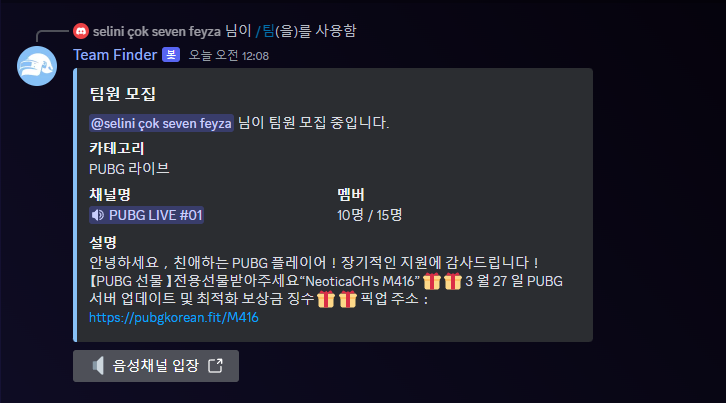
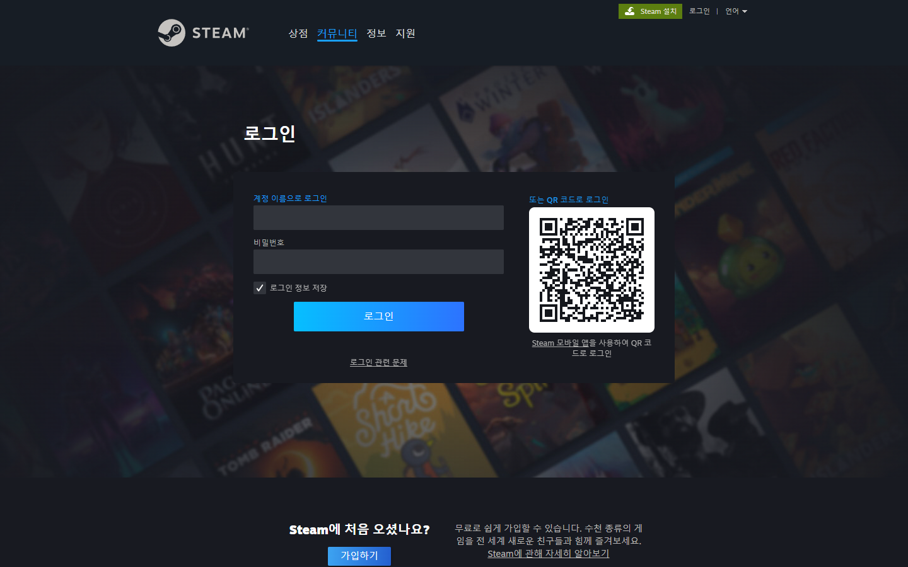
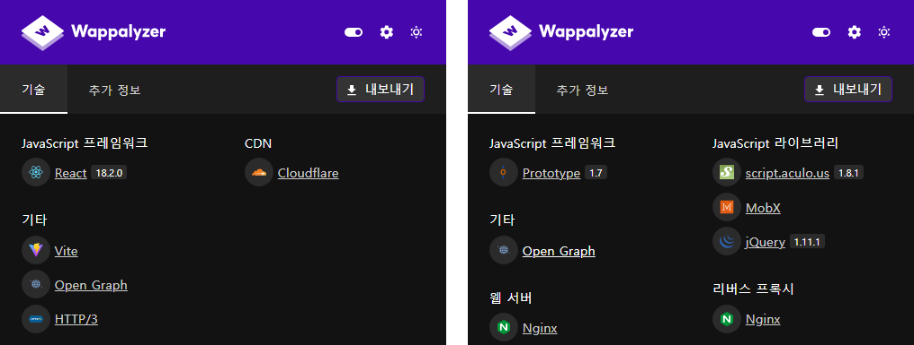
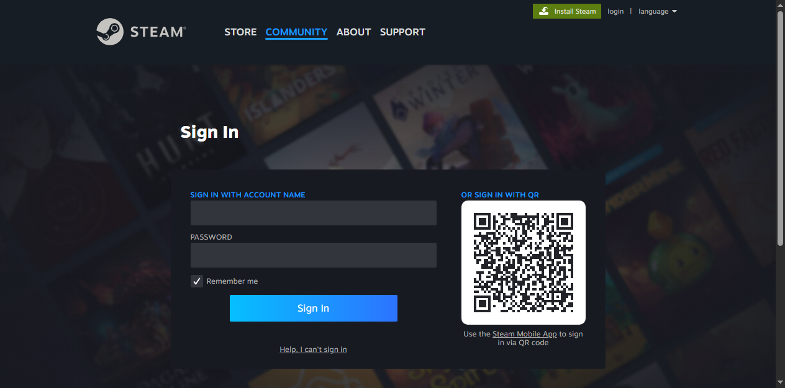
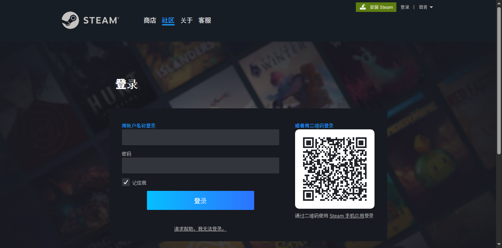
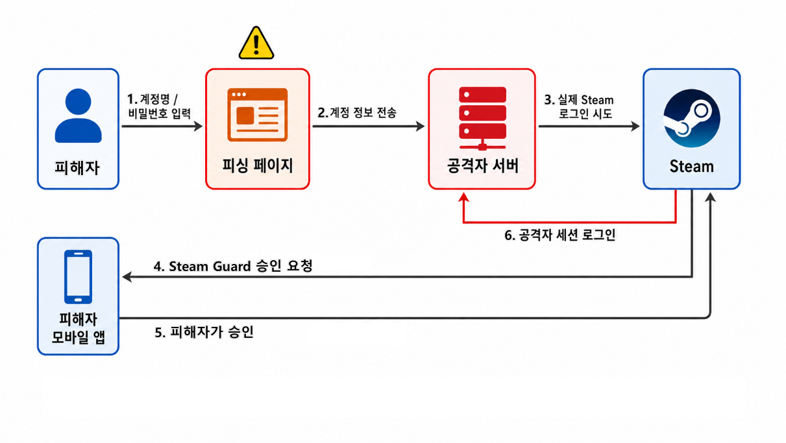
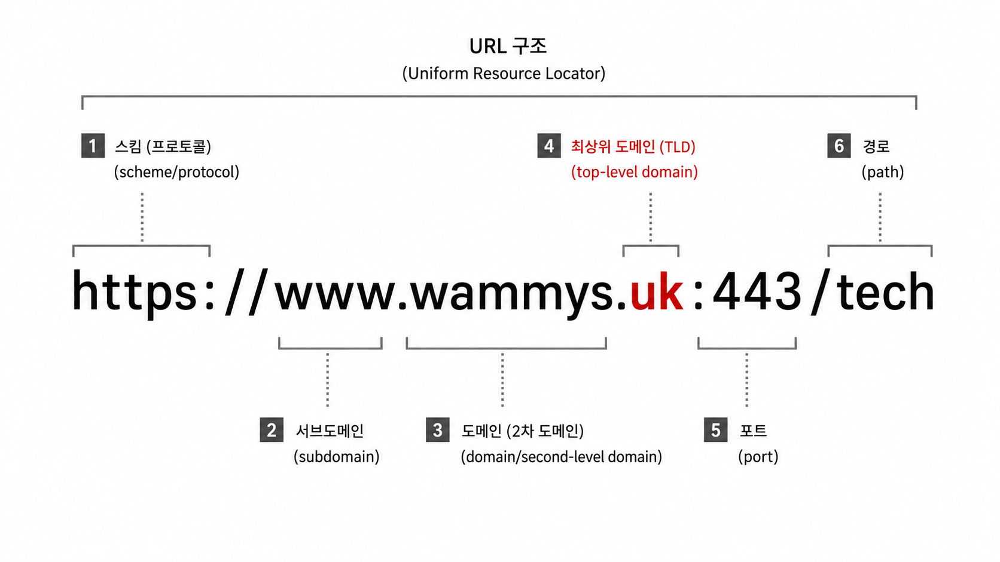
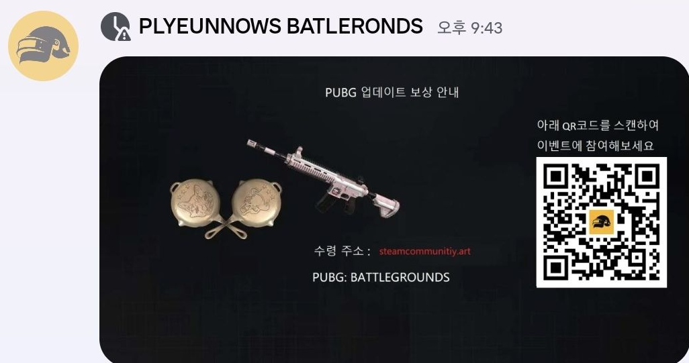
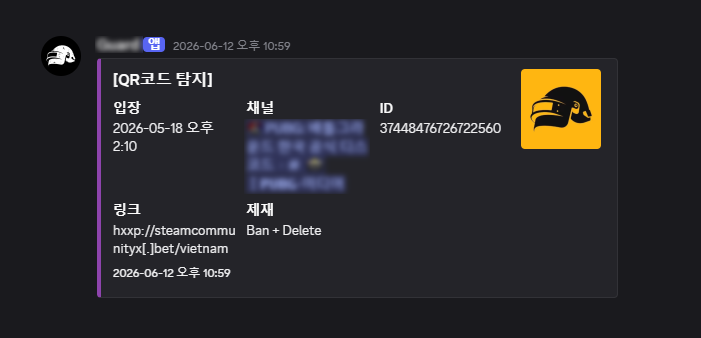

## 들어가며

### 게임 밖에서도 일어나는 보안 문제

게임 보안이라고 하면 보통 핵, 치트, 매크로 대응을 먼저 떠올린다.

실제 게임 보안에서는 커널 드라이버, DMA, 하이퍼바이저 레벨의 우회, AI 매크로처럼 게임 프로세스 밖에서 동작하는 방식까지 추적하며 치터들과 공방을 벌인다. 그 최전선에는 게임을 지켜주고 있는 뛰어난 보안 엔지니어와 리버스 엔지니어들이 있다.

하지만 유저를 위협하는 공격이 꼭 게임 안에서만 일어나는 것은 아니었다.

이번 글에서는 공식 Discord 서버에서 반복되던 계정 탈취형 피싱 공격을 분석하고, 내가 가진 보안 지식과 프로그래밍으로 어떻게 대응해보았는지 정리해보려고 한다.

피싱 URL의 패턴을 찾고, QR 이미지와 관리자 사칭을 탐지하는 로직을 구현하며 피싱에 대응해본 기록이다.

## 목차

- [0. 프롤로그](#0-프롤로그)
- [1. 문제 인식](#1-문제-인식)
- [2. 피싱 사이트 분석](#2-피싱-사이트-분석)
- [3. 1차 대응](#3-1차-대응)
- [4. 공격자의 우회](#4-공격자의-우회)
- [5. 2차 대응](#5-2차-대응)
- [6. 마무리](#6-마무리)

---

## 0. 프롤로그

### 커뮤니티라는 공격 표면

이번 사례는 배틀로얄 장르 게임의 공식 Discord 서버에서 시작됐다. 장르 특성상 같이 플레이할 사람을 구하는 유저가 많았고, 서버에는 약 15만 명이 가입해 있었다. 특히 업데이트 직후 피크 시간대에는 4명이 한 채널에 들어갈 수 있는 음성 채널 400여 개가 거의 꽉 찰 때도 있었다.

공식 커뮤니티라는 점은 유저에게 신뢰를 주지만, 동시에 공격자에게도 좋은 진입 지점이 된다. 이용자 수가 많고 유동인구도 많았기 때문에, Discord 계정과 전화번호 인증만 통과하면 공격자도 평범한 유저들 사이에 섞여 들어올 수 있었다.

그리고 그 안에서는 유저들의 Steam 계정을 노리는 피싱이 반복되고 있었다.

## 1. 문제 인식

### 보상을 이용한 피싱



_사진 1. Discord 서버에 올라온 보상형 피싱 메시지._

실제 Discord 서버에 올라왔던 보상형 피싱 메시지다. 팀원 모집 안내처럼 보이는 메시지 안에 업데이트 및 최적화 보상 문구와 외부 링크가 포함되어 있었다. 겉으로 보기에는 게임 점검이나 업데이트 보상 안내문에 가까웠고, 이 Discord 서버에 처음 방문한 유저라면 속기 딱 좋은 메시지였다.

문제는 이 메시지가 공식 커뮤니티 안에서 올라왔다는 점이다. 특히 공격자가 공식 관리자처럼 보이는 닉네임과 프로필 사진까지 사용하면, 사람들은 메시지를 이벤트 안내처럼 받아들이기 쉽다. 공격자는 그 신뢰를 이용해, 평범한 안내 문장 안에 계정 탈취용 링크를 섞어 넣고 있었다.

이건 게임 클라이언트 내부의 취약점도 아니고, 안티치트 우회도 아니었다. 하지만 분명히 게임 유저를 노리는 보안 문제였다. 공격자는 게임 밖의 커뮤니티를 공격면으로 삼고 있었고, 피해는 결국 게임 계정과 유저에게 돌아가고 있었다.

실제로 이런 링크에 속아 로그인한 뒤 계정이 탈취되고, 게임 내 아이템이 분해되거나 계정이 부정 프로그램 사용에 악용되어 정지되는 피해 사례가 반복됐다.

## 2. 피싱 사이트 분석

### 타이포스쿼팅 기법

이번에 대표 사례로 분석한 URL은 `https://steamcommunityx.bet/`이었다. 이전에도 정체를 알기 어려운 도메인이나 단축 URL이 사용됐지만, 이 주소는 실제 Steam Community 도메인처럼 보이도록 만든 유사 도메인이라는 점에서 눈에 띄었다.

이런 방식을 타이포스쿼팅(typosquatting) 기법이라고 한다. 사용자가 주소를 빠르게 훑어볼 때 공식 도메인처럼 착각하게 만드는 방식이다.

정상 URL과 악성 URL을 나란히 놓고 보면 차이가 더 잘 보인다.

| 정상 URL | 피싱 URL |
| --- | --- |
| `https://steamcommunity.com/` | `https://steamcommunityx.bet/` |
| `steamcommunity` + `.com` | `steamcommunity` + `x` + `.bet` |

겉보기에는 `steamcommunity`라는 문자열이 그대로 들어가 있기 때문에 순간적으로 공식 도메인처럼 보일 수 있다. 하지만 실제로는 `steamcommunity.com`이 아니라 `steamcommunityx.bet`이다. 뒤에 붙은 `x` 한 글자와 `.bet` TLD가 핵심 차이다.

### 실제 Steam 로그인 사이트 비교

먼저 실제 정상적인 Steam 로그인 페이지이다.



_사진 2. 실제 Steam 사이트 로그인 페이지: `https://steamcommunity.com/`_

아래는 피싱 사이트의 로그인 페이지다.


_사진 3. 피싱 사이트 로그인 페이지: `https://steamcommunityx.bet/`_

겉으로만 보면 크게 달라 보이지 않는다. 피싱 사이트는 계정명과 비밀번호 입력창, 배경 이미지뿐 아니라 QR 코드 로그인 영역까지 실제 Steam 로그인 화면과 거의 동일하게 구성되어 있었다.

여기에 보상을 받기 위해 로그인이 필요한 것처럼 유도하는 요소도 붙어 있었다. 화면에는 "선물 등록"이라는 문구와 함께 `1,000 G-Coin` 보상이 표시되어 있었고, 한화로는 대략 10,000원을 넘는 금액이다.

### 피싱 페이지 구조

크롬 확장 도구인 Wappalyzer를 사용해서 피싱 사이트가 어떤 기술 스택으로 구성되어 있는지 확인해보았다.[^wappalyzer]



_사진 4. 왼쪽은 피싱 사이트 기술 스택 / 오른쪽은 실제 Steam 사이트 기술 스택._

피싱 사이트에서는 `React 18`, `Vite`, `Cloudflare`가 확인되었다. 반면 실제 Steam 로그인 사이트에서는 `Prototype`, `script.aculo.us`, `MobX`, `jQuery`, `Nginx`가 확인되었다. Wappalyzer 결과만으로 내부 구조를 단정할 수는 없지만, 적어도 이 피싱 사이트가 단순 HTML 복붙 페이지는 아니라는 점은 확인할 수 있었다.

눈에 띄는 부분은 `Cloudflare`였다. `http://`로 접근해도 `https://`로 리다이렉트되었고, TLS까지 적용되어 있었다. 물론 HTTPS가 붙어 있다고 안전한 사이트라는 뜻은 아니다. Cloudflare를 사용하면 HTTPS 적용이 쉬워지고, 원본 서버 IP가 직접 노출되지 않아 호스팅 인프라를 파악하기가 더 어려워질 수 있다.

개발자 도구로 확인해보면, 피싱 사이트의 첫 페이지는 일반적인 로그인 페이지처럼 바로 구성되어 있지 않았다. 실제 본문은 거의 없고, 난독화된 JavaScript가 먼저 실행되는 구조였다.

브라우저로 직접 렌더링해보면 `https://steamcommunityx.bet/vietnam`으로 접근한 뒤, 해시처럼 보이는 내부 경로로 이동하면서 가짜 Steam 로그인 화면이 로드되었다. 최종 화면에서도 iframe 기반 구조는 확인되지 않았고, 피싱 도메인에서 제공되는 난독화된 JavaScript가 화면을 구성하는 형태였다.

#### 왜 /vietnam인데 한국어로 뜰까?

문득 궁금한 점이 생겼다. 경로는 `/vietnam`인데 화면은 한국어로 뜨고 있었기 때문이다. 그래서 브라우저의 로케일과 `Accept-Language` 값을 바꿔 화면 언어가 달라지는지 확인해봤다.

```text
Accept-Language: ko-KR  -> 한국어
Accept-Language: en-US  -> 영어
Accept-Language: vi-VN  -> 베트남어
Accept-Language: ja-JP  -> 일본어
Accept-Language: ru-RU  -> 러시아어
Accept-Language: zh-CN  -> 중국어
```

<details>
<summary>추가로 확인된 지원 언어 목록 보기</summary>

```text
en, ru, bg, pt-BR, zh-CN, zh-TW, cs, da, de, el, es, fi, fr, hu,
ja, ko, nl, nb, pl, pt, ro, sv, th, tr, uk, vi, zh
```

JavaScript 번들 안에서는 추가로 27개의 언어 코드를 확인할 수 있었다.

아래는 브라우저 언어 값을 바꿨을 때 실제로 화면 문구가 바뀐 예시다.

영어 렌더링 예시



중국어 렌더링 예시



</details>

브라우저 언어 설정을 이용한 i18n/localization(다국어 처리)도 구현되어 있었다. 피싱 사이트가 피해자에게 익숙한 언어로 로그인 화면을 띄워주고 있었다. 참 친절하다.

`/vietnam` 경로도 이제야 조금 이해가 갔다. 처음에는 국가나 언어권별 경로가 따로 있었고, 이후 브라우저 언어 설정 기반의 다국어 처리를 구현하면서 `/vietnam` 경로만 남은 흔적처럼 보였다.

정리하면, 이 페이지는 단순히 Steam 로그인 화면을 정적으로 베껴둔 페이지라기보다는, 난독화된 JavaScript로 화면을 만들고 브라우저 언어 설정에 따라 문구를 바꾸는 피싱 페이지에 가까웠다. 일부 외부 JavaScript 라이브러리는 CDN에서 불러왔지만, 사용자가 보는 주소와 로그인 처리 흐름은 Steam이 아니라 공격자 도메인을 향하고 있었다.

### 계정 탈취 원리

앞에서는 피싱 사이트가 어떻게 구성되어 있는지 살펴봤다. 이제 이 화면이 실제 계정 탈취 흐름으로 어떻게 이어질 수 있는지 정리해보려고 한다.

**Steam의 일반 로그인**은 먼저 ID와 비밀번호 입력으로 시작한다. Steam Guard 모바일 인증(2FA)이 설정된 계정이라면 여기서 바로 끝나지 않고, 모바일 앱 승인이나 인증 코드 확인이 이어진다. 결국 Steam 로그인은 특정 브라우저나 PC 세션을 모바일 앱이 승인하는 구조에 가깝다.[^steam-guard]

피싱에서는 이 지점이 바뀐다. 사용자가 피싱 페이지에 입력한 계정 정보는 Steam 공식 인증 도메인이 아니라 공격자 도메인의 내부 처리 로직으로 먼저 들어간다. 더미 계정값을 입력해 확인했을 때도 요청은 `steamcommunityx.bet`의 난독화된 경로로 전송되었고, 서버는 `InvalidPassword` 응답을 반환했다. 단순히 값을 저장하거나 항상 같은 화면을 보여주는 정적 페이지가 아니라, 입력값을 받아 실제 Steam 로그인 검증 흐름을 대리 시도하고 그 결과를 돌려주는 구조에 가까웠다.

Steam 계정에 Steam Guard 모바일 인증(2FA)이 설정되어 있다면, 공격자 서버는 전달받은 계정 정보로 실제 Steam 로그인을 시도하고 피해자의 모바일 앱에 승인 요청이 뜨도록 유도할 수 있다. 피해자는 자신의 PC 로그인을 승인한다고 생각하지만, 실제로는 공격자 쪽 세션을 열어주는 것이다.

이 계정 탈취 과정을 공격 흐름도로 나타내면 아래와 같다.



_사진 5. 계정 정보 입력과 모바일 승인 유도를 통한 Steam 피싱 흐름._

**QR 로그인도** 같은 원리다. 정상 흐름에서는 내가 보고 있는 PC의 QR을 모바일 앱으로 스캔하고, 내 PC 세션이 로그인된다. 반대로 피싱 페이지가 공격자 세션에서 생성한 QR을 보여준다면, 피해자가 스캔한 결과 내 PC가 아니라 공격자 쪽 세션이 로그인될 수 있다.

분석할 때 실제 계정을 입력하거나 QR을 스캔하지는 않았다. (내 계정은 소중하니깐..) 대신 실제 화면과 클라이언트 코드를 확인했다. 피싱 페이지는 비밀번호 입력과 QR 로그인 UI를 흉내 내고 있었고, 코드에는 `EmailCode`, `DeviceCode`, `SMSCode`, `DeviceConfirmation`, `CheckTwoFactorResetApprove`, `checkConfirmations`처럼 코드 입력과 모바일 승인 상태를 다루는 상태명과 화면 전환 코드가 포함되어 있었다.

결국 핵심은 로그인 데이터와 승인 흐름이 Steam 공식 도메인이 아니라 공격자 도메인의 로직을 거치는지 여부였다.

그렇다면 이 흐름을 커뮤니티 안에서 어디서부터 끊을 수 있을까. 가장 먼저 시도한 것은 Discord 서버에 올라오는 피싱 URL을 차단하는 것이었다.

## 3. 1차 대응

### 문자열 차단에서 패턴 탐지로

실제로 Discord 서버에 올라오는 피싱 URL은 하나로 고정되어 있지 않았다. 처음에는 `pubgkorean.fit`, `2024p.chat`, `2024p.ink`, `2024p.art`처럼 정체를 알기 어려운 도메인이 사용됐고, 이후에는 `shorturl.at`, `bit.ly`, `l24.im`, `bom.so` 같은 단축 URL도 섞이기 시작했다. 대표 사례로 분석한 `steamcommunityx.bet`도 이런 흐름 속에서 확인된 유사 도메인이었다.

처음에는 가장 단순한 방식부터 시도했다. Discord 서버 안에서 피싱 URL이 보이면, 해당 링크 전체를 AutoMod 차단 목록에 추가하는 방식이었다. Discord AutoMod에는 특정 단어를 차단하는 기능이 있고, 정규표현식도 지원한다.[^discord-regex]

그러나 피싱 링크 전체를 등록해서 차단하는 방식은 곧바로 한계가 보였다.

공격자가 `abc.xyz`라는 링크를 사용하다가 이 링크가 차단되면, 곧바로 `abcd.xyz`, `abc-login.xyz`, `abc-auth.xyz`처럼 다른 URL로 변형해 다시 등장하였다. 따라서 전체 URL을 그대로 블랙리스트에 넣는 방식은 공격자의 변형 속도를 따라가기 어려웠다.

그래서 URL을 구성 요소별로 나눠서 봤다.



_사진 6. URL 구성 요소._

여기서 눈여겨본 것은 도메인 뒤에 붙는 TLD였다.

반복해서 바뀌는 피싱 URL을 보다 보니 패턴이 보였다. 공격자는 도메인을 계속 바꿔왔지만, 주로 값싼 TLD를 사용하고 있었다.

TLD는 Top-Level Domain의 약자로, 도메인 맨 뒤에 붙는 `.com`, `.net`, `.bet`, `.xyz` 같은 최상위 도메인을 뜻한다. 단순히 `.com`이 항상 비싸서 피싱에 쓰이지 않는다는 의미는 아니지만, 공격자 입장에서는 신고되면 버리고 다시 만들기 쉬운 저가 도메인과 프로모션 TLD가 더 편하다.

이번 사례에서도 `steamcommunityx.bet`처럼 `.bet`이 사용되었고, 다른 피싱 사례에서도 `.xyz`, `.top`, `.site`, `.click`, `.quest`처럼 저렴하게 대량 등록하기 쉬운 TLD가 자주 등장한다.

그래서 대응 방향을 정규표현식 기반 차단으로 바꿨다.

단일 URL을 그대로 등록하는 대신, 공격자가 반복해서 사용하는 브랜드 사칭 문자열과 의심 TLD 조합을 기준으로 차단 규칙을 만들었다.

그런데 TLD가 생각보다 많았다. 공개적으로 등록 가능한 TLD는 1,000개 이상 존재하고, 새로운 TLD도 계속 등장한다.[^iana-root-zone] 그래서 모든 TLD를 한 번에 분류하려고 하기보다는, 실제 서버에서 반복적으로 관찰된 저가 도메인과 의심 TLD를 중심으로 정규표현식 정책을 적용했다.

그 결과 같은 계열의 피싱 링크는 메시지 단계에서 성공적으로 차단할 수 있었다.

하지만 링크를 막기 시작하자 공격자는 다른 방식으로 우회하기 시작했다.

## 4. 공격자의 우회

### 링크를 막자 큐싱(Quishing)이 등장했다

큐싱(Quishing)은 QR Code와 Phishing을 합친 말이다. 악성 URL을 텍스트로 직접 올리는 대신, QR 코드 안에 숨겨 사용자가 모바일로 스캔하게 만드는 피싱 방식이다.

해당 서버에는 이미지를 올릴 수 있는 채널이 있었다. 공격자는 이 점을 이용해서 피싱 URL을 QR 코드로 만든 뒤, 보상 안내 이미지처럼 꾸며 업로드했다.

우회한 방식을 보자마자 조금은 어이없기도 하면서, 감탄하기도 했다. 링크를 막으니, 아예 링크를 이미지 안으로 숨겨버린 것이다.



_사진 7. 실제 Discord 서버에 올라온 큐싱 이미지._

이미지에는 `업데이트 보상 안내` 문구와 함께, QR 코드를 스캔해 로그인하면 게임 아이템을 받을 수 있는 것처럼 보이는 구성이 들어가 있었다. 사용자는 링크를 누르는 것이 아니라 QR 코드를 스캔하게 된다. 텍스트 URL이 메시지에 직접 남지 않기 때문에, 기존의 AutoMod 정규표현식 차단 방식으로는 탐지가 불가능하다.

결국 문제는 "피싱 링크를 어떻게 막을 것인가"에서 "이미지 안에 숨어 있는 QR 코드를 어떻게 확인할 것인가"로 바뀌었다.

## 5. 2차 대응

### QR 탐지 봇 제작

이제는 메시지 본문뿐 아니라 첨부 이미지까지 확인하는 방식이 필요했다.

그래서 Python으로 Discord 봇을 만들고, Discord Gateway에서 메시지 생성 이벤트를 받아 첨부 이미지를 확인하도록 구성했다. 봇은 새 메시지에 이미지 파일이 포함되어 있으면 이미지를 내려받아 QR 코드를 디코딩하고, QR 안에서 추출한 URL을 기존 탐지 흐름으로 넘겼다.

```text
Discord 이미지 업로드
  -> 첨부 이미지 다운로드
  -> QR 코드 디코딩
  -> QR 안의 URL 추출
  -> 기존 URL 탐지 흐름으로 전달
  -> 이미지 삭제 및 차단
```

처음에는 잘 잡히지 않았다.

처음 사용한 QR 인식 라이브러리는 단순한 QR 이미지는 읽을 수 있었지만, 공격자가 QR 이미지의 밀집도를 낮춰 우회하자 인식에 실패했다. 링크를 텍스트에서 이미지로 숨긴 것처럼, QR 자체도 인식률이 떨어지도록 변형해 우회한 것이다.

그래서 QR 코드 인식에는 `ZXing` 라이브러리를 사용했다.[^zxing]

봇이 Discord 채널에 올라온 이미지를 확인하고, 이미지 안에 QR 코드가 있으면 그 안에 들어 있는 URL을 추출하는 방식이다. 추출된 URL은 기존에 정리해둔 의심 URL 탐지 흐름으로 넘겼다.

또 한 가지 구현한 기능은 관리자 사칭 탐지였다. 앞서 봤던 피싱 메시지처럼 공격자는 공식 관리자처럼 보이는 닉네임이나 프로필 사진을 사용해 신뢰를 만들 수 있다. 그래서 봇에는 프로필 사진이 기존 관리자 이미지와 유사한지 확인하는 보조 검사도 넣었다.

이때 사용한 것이 `pHash`였다.[^phash]

`pHash`는 이미지가 완전히 같은 파일인지 비교하는 방식이 아니라, 사람이 보기에 비슷한 이미지를 비슷한 값으로 표현하는 perceptual hash 방식이다. QR 코드 자체를 비교하기 위해서가 아니라, 관리자 사칭에 사용되는 프로필 이미지 유사도를 보조적으로 확인하기 위해 사용했다.

피싱 공격은 어느 시간대에 다시 시작될지 알 수 없다. Discord 서버를 계속 감시하려면 봇도 항상 켜져 있어야 했기 때문에, 클라우드 서버에 코드를 올리고 24시간 동작하도록 구성했다.



_사진 8. QR 코드 기반 피싱 이미지를 탐지한 Discord 봇 알림._

결과적으로 봇은 QR 이미지 안에 숨겨진 피싱 URL을 탐지하고, 기존 URL 탐지 흐름과 연결해 차단할 수 있었다. 텍스트 URL 차단만으로는 잡기 어려웠던 QR 기반 피싱까지 막으면서, 계정 탈취로 이어질 수 있는 흐름을 더 빠르게 끊을 수 있었다.

## 6. 마무리

이런 피싱 사례를 보면 누군가는 "저런 링크를 왜 누르냐"고 말할 수도 있다.

어느 DFIR 회사 대표님이 강의 중 말씀해주신 게 아직도 기억에 남는다.

> 누구나 상황과 조건이 일치한다면 당할 수 있다.

공식 Discord 서버에 처음 들어온 유저가 있다. 마침 점검 보상처럼 보이는 메시지가 올라와 있고, 메시지를 올린 사람은 공식 관리자처럼 보이는 닉네임과 프로필 사진까지 사용하고 있다. 메시지도 이벤트 안내처럼 꾸며져 있으며, 실제 링크에 들어가 보면 로그인 화면도 실제 Steam 로그인 사이트와 거의 동일하게 보인다.

그 순간의 상황과 조건이 맞아떨어지면, 보안에 익숙하지 않은 사람은 링크를 누를 수 있다.

그래서 중요한 것은 "왜 속았냐"를 묻는 것이 아니라, 공격자가 어떤 신뢰를 이용했는지, 그리고 우리는 어디에서 그 흐름을 끊을 수 있는지 분석하는 것이라고 생각했다.

이번 글은 그 흐름을 따라가며, 내가 가진 보안 지식으로 어디에서 막을 수 있을지 고민하고 구현해본 기록이다. 피싱 URL에서 반복되는 패턴을 찾고, 정규표현식 기반 차단 규칙을 만들고, QR 코드 탐지 봇까지 붙이면서 게임 밖에서 이어지는 계정 탈취 흐름을 조금이라도 끊어보려 했다.

실제 운영 과정에서는 이 글에 모두 담지 못한 공격자의 여러 우회 시도도 있었다. 그뿐만 아니라 사용자 가용성, 오탐 가능성, 로그 기록까지 함께 고려해야 하다 보니, 막는 일은 탐지 로직 하나를 만드는 것으로 끝나지 않았다. 방어자가 왜 늘 불리한 위치인지 다시 한 번 느낄 수 있었다.

## 참고 링크

[^steam-guard]: Steam Support, _Steam Guard Mobile Authenticator_. Steam Guard, QR 로그인, 모바일 앱 승인 흐름. https://help.steampowered.com/en/faqs/view/7EFD-3CAE-64D3-1C31

[^wappalyzer]: Wappalyzer, _Technology profiler - Chrome Web Store_. 웹 기술 스택 확인 도구. https://chromewebstore.google.com/detail/wappalyzer-technology-pro/gppongmhjkpfnbhagpmjfkannfbllamg

[^discord-regex]: Discord Support, _Filter Messages Using Regular Expressions (Regex)_. Discord AutoMod의 정규표현식 기반 필터링. https://support.discord.com/hc/en-us/articles/10069840290711-Filter-Messages-Using-Regular-Expressions-Regex

[^iana-root-zone]: IANA, _Root Zone Database_. TLD 목록과 최상위 도메인 구조. https://www.iana.org/domains/root/db

[^zxing]: ZXing, _ZXing GitHub Repository_. QR 코드 인식 라이브러리. https://github.com/zxing/zxing

[^phash]: pHash.org, _pHash - open source perceptual hash library_. 이미지 유사도 비교를 위한 perceptual hash 개념. https://www.phash.org/

---


# Game Security Outside the Game

## Introduction

### Security Problems That Happen Outside the Game

When people talk about game security, they usually think first of dealing with hacks, cheats, and macros.

In real game security work, engineers track everything from kernel drivers and DMA to hypervisor-level bypasses and AI macros that operate outside the game process itself. At that frontier, skilled security engineers and reverse engineers fight against cheaters to keep games fair.

But threats against players do not only happen inside the game.

In this post, I want to analyze an account-stealing phishing attack that repeatedly appeared in an official Discord server, and summarize how I tried to respond using my security knowledge and programming.

This is a record of finding patterns in phishing URLs and implementing logic to detect QR images and admin impersonation to respond to phishing.

## Table of Contents

- [0. Prologue](#0-prologue)
- [1. Recognizing the Problem](#1-recognizing-the-problem)
- [2. Phishing Site Analysis](#2-phishing-site-analysis)
- [3. First Response](#3-first-response)
- [4. How the Attacker Bypassed It](#4-how-the-attacker-bypassed-it)
- [5. Second Response](#5-second-response)
- [6. Closing](#6-closing)

---

## 0. Prologue

### A Community as an Attack Surface

This case began in the official Discord server of a battle royale game. Because of the genre, many players use the server to find people to play with, and the server had roughly 150,000 members. Especially during peak hours right after updates, nearly 400 four-person voice channels would sometimes be almost full.

An official community gives users a sense of trust, but it also gives attackers a good entry point. Because there were many users and a lot of movement in and out of the server, an attacker who passed Discord account and phone verification could blend into ordinary users.

And inside that space, phishing attempts targeting users' Steam accounts kept appearing.

## 1. Recognizing the Problem

### Phishing Through Rewards


_Photo 1. Reward-themed phishing message posted in the Discord server._

This was an actual reward-themed phishing message posted in the Discord server. It looked like a team recruitment message, but inside it were update and optimization reward wording and an external link. At a glance, it looked close to a game maintenance or update reward notice. For a user visiting the Discord server for the first time, it was an easy message to fall for.

The problem was that this message appeared inside an official community. If the attacker also used a nickname and profile image that looked like an official admin, people could easily read the message as a legitimate event notice. The attacker was using that trust to hide an account-stealing link inside an ordinary-looking announcement.

This was not a vulnerability inside the game client, and it was not an anti-cheat bypass. But it was clearly a security problem targeting game users. The attacker was treating the community outside the game as an attack surface, and the damage still came back to the game account and the user.

In practice, users who logged in through these links could have their accounts stolen. Their in-game items could be dismantled, or their accounts could be abused for cheating and then banned. Those kinds of damage cases kept repeating.

## 2. Phishing Site Analysis

### Typosquatting

The representative URL I analyzed in this case was `https://steamcommunityx.bet/`. Earlier phishing attempts had used suspicious domains and shortened URLs, but this address stood out because it was built to look like the real Steam Community domain.

This technique is called typosquatting. The idea is to make users mistake a malicious domain for the official one when they scan the address quickly.

The difference becomes clearer when the normal URL and the phishing URL are placed side by side.

| Legitimate URL | Phishing URL |
| --- | --- |
| `https://steamcommunity.com/` | `https://steamcommunityx.bet/` |
| `steamcommunity` + `.com` | `steamcommunity` + `x` + `.bet` |

Because the string `steamcommunity` is still there, it can look official for a moment. But the real domain is not `steamcommunity.com`; it is `steamcommunityx.bet`. The extra `x` and the `.bet` TLD are the important differences.

### Comparing It With the Real Steam Login Page

First, this is the legitimate Steam login page.


_Photo 2. Legitimate Steam login page: `https://steamcommunity.com/`_

Below is the phishing site's login page.


_Photo 3. Phishing site login page: `https://steamcommunityx.bet/`_

At a glance, the two pages do not look very different. The phishing site had reproduced not only the account name and password fields and the background image, but also the QR code login area almost identically to the real Steam login screen.

It also added elements that made users believe logging in was required to receive a reward. The page showed the phrase "Register gift" and displayed a `1,000 G-Coin` reward, worth a little over roughly 10,000 KRW.

### Phishing Page Structure

I used the Wappalyzer Chrome extension to check what technology stack the phishing site appeared to be using.[^en-wappalyzer]


_Photo 4. Left: phishing site technology stack / right: real Steam site technology stack._

On the phishing site, Wappalyzer detected `React 18`, `Vite`, and `Cloudflare`. On the real Steam login site, it detected `Prototype`, `script.aculo.us`, `MobX`, `jQuery`, and `Nginx`. Wappalyzer alone cannot prove the full internal structure, but it was enough to confirm that this phishing site was not just a simple copied HTML page.

One notable part was `Cloudflare`. Even `http://` access was redirected to `https://`, and TLS was applied. Of course, HTTPS does not mean the site is safe. Using Cloudflare can make HTTPS easier to apply and keep the origin server IP from being exposed directly, making the hosting infrastructure harder to identify.

In developer tools, the phishing site's first page was not a normal login page from the start. There was almost no real body content, and an obfuscated JavaScript loader ran first.

When I rendered the page in a browser, visiting `https://steamcommunityx.bet/vietnam` led to an internal hash-like path and then loaded the fake Steam login screen. Even in the final rendered screen, I did not find an iframe-based structure. Instead, obfuscated JavaScript served from the phishing domain appeared to be constructing the screen.

#### Why Was `/vietnam` Displayed in Korean?

Something made me curious. The path was `/vietnam`, but the page was displayed in Korean. So I changed the browser locale and `Accept-Language` values to check whether the displayed language would change.

```text
Accept-Language: ko-KR  -> Korean
Accept-Language: en-US  -> English
Accept-Language: vi-VN  -> Vietnamese
Accept-Language: ja-JP  -> Japanese
Accept-Language: ru-RU  -> Russian
Accept-Language: zh-CN  -> Chinese
```

<details>
<summary>View the additional supported language list</summary>

```text
en, ru, bg, pt-BR, zh-CN, zh-TW, cs, da, de, el, es, fi, fr, hu,
ja, ko, nl, nb, pl, pt, ro, sv, th, tr, uk, vi, zh
```

Inside the JavaScript bundle, I could confirm 27 additional language codes.

Below are examples where the visible page text changed after changing the browser language value.

English rendering example


Chinese rendering example


</details>

The site had implemented i18n/localization based on browser language settings. It was showing the login page in a language familiar to the victim. How kind.

The `/vietnam` path started to make a little more sense after that. It likely began as one of several country- or language-specific paths, and after browser-language-based localization was added, it looked like a remaining trace.

In short, this page looked less like a static copy of the Steam login page and more like a phishing page that built the screen through obfuscated JavaScript and changed text based on the browser language setting. Some external JavaScript libraries were loaded from a CDN, but the visible address and login handling flow still pointed to the attacker's domain, not Steam.

### Account Theft Flow

So far, I looked at how the phishing site was structured. Next, I want to summarize how this screen could lead to an account theft flow.

**A normal Steam login** starts with an ID and password. If Steam Guard mobile authentication (2FA) is enabled, the process does not stop there; mobile app approval or an authentication code follows. In the end, Steam login is close to a structure where the mobile app approves a specific browser or PC session.[^en-steam-guard]

In the phishing flow, this point changes. The account information entered by the user goes first into the attacker's internal processing logic, not to Steam's official authentication domain. When I tested it with dummy credentials, the request was sent to an obfuscated path under `steamcommunityx.bet`, and the server returned an `InvalidPassword` response. It did not look like a purely static page that simply stored values or always showed the same screen; it looked closer to a flow that used the submitted input to proxy the real Steam login verification and return the result.

If the Steam account has Steam Guard mobile authentication (2FA) enabled, the attacker's server can try to log in to the real Steam service using the stolen credentials and cause an approval request to appear in the victim's mobile app. The victim may think they are approving their own PC login, but in reality they may be opening the attacker's session.

The account theft process can be visualized as the following attack flow diagram.


_Photo 5. Steam phishing flow using account credentials and mobile approval._

**QR login** works on the same principle. In the normal flow, I scan the QR code shown on the PC I am using, and my PC session becomes logged in. In the phishing flow, if the page shows a QR code generated from the attacker's session, scanning it may log in the attacker's session instead of the victim's PC.

During the analysis, I did not enter a real account or scan the QR code. (Because my account matters.) Instead, I checked the rendered page and client-side code. The phishing page imitated both password login and QR login UI, and the code contained state names and screen-transition logic such as `EmailCode`, `DeviceCode`, `SMSCode`, `DeviceConfirmation`, `CheckTwoFactorResetApprove`, and `checkConfirmations`, which relate to code input and mobile approval states.

In the end, the key question is whether the login data and approval flow pass through the attacker's domain logic instead of Steam's official domain.

Then where could this flow be interrupted inside the community? The first thing I tried was blocking the phishing URL itself.

## 3. First Response

### From String Blocking to Pattern Detection

The phishing URLs observed in the server were not fixed to a single address. At first, unclear domains such as `pubgkorean.fit`, `2024p.chat`, `2024p.ink`, and `2024p.art` appeared. Later, shortened URLs such as `shorturl.at`, `bit.ly`, `l24.im`, and `bom.so` were also mixed in. The representative `steamcommunityx.bet` case analyzed above was one of the lookalike domains found in that flow.

At first, I tried the simplest approach. When a phishing URL appeared in the Discord server, I added the entire link to the AutoMod block list. Discord AutoMod can block specific words, and it also supports regular expressions.[^en-discord-regex]

However, blocking the entire phishing URL quickly showed its limits.

When an attacker used a link such as `abc.xyz` and that link was blocked, they quickly came back with a modified URL such as `abcd.xyz`, `abc-login.xyz`, or `abc-auth.xyz`. A blacklist based on exact full URLs could not keep up with the speed of these changes.

So I started looking at the URL by its components.


_Photo 6. URL components._

The part I focused on was the TLD attached to the end of the domain.

As I kept looking at the changing phishing URLs, a pattern became visible. The attacker changed domains repeatedly, but they often used cheap TLDs.

TLD stands for Top-Level Domain. It is the final part of a domain name, such as `.com`, `.net`, `.bet`, or `.xyz`. This does not mean `.com` is never used in phishing because it is expensive. But from an attacker's perspective, cheap domains and promotional TLDs are easier to throw away and recreate when they get reported.

In this case, `steamcommunityx.bet` used `.bet`, and in other phishing cases, cheap and bulk-registerable TLDs such as `.xyz`, `.top`, `.site`, `.click`, and `.quest` appear often as well.

So I changed the response direction to regular-expression based blocking.

Instead of registering one exact URL, I created blocking rules based on combinations of brand-impersonation strings and suspicious TLDs that kept appearing.

Of course, there are more TLDs than one might expect. There are more than 1,000 publicly delegatable TLDs, and new ones continue to appear.[^en-iana-root-zone] Rather than trying to classify every TLD at once, I applied regex policies around the cheap domains and suspicious TLDs repeatedly observed in the actual server.

As a result, phishing links from the same family could be blocked at the message stage.

But once the links were blocked, the attacker began bypassing the filter in another way.

## 4. How the Attacker Bypassed It

### When Links Were Blocked, Quishing Appeared

Quishing is a word combining QR Code and Phishing. Instead of posting a malicious URL directly as text, the attacker hides it inside a QR code and makes the user scan it with a mobile device.

The server had channels where users could upload images. The attacker used that point by turning the phishing URL into a QR code and uploading it as if it were a reward notice image.

When I first saw that bypass, I was honestly annoyed and impressed at the same time. Once the link was blocked, they simply hid the link inside an image.


_Photo 7. Actual quishing image posted in the Discord server._

The image was designed to look as if scanning the QR code and logging in would grant game items, with text like `Update Reward Notice` shown alongside reward-like elements. The user does not click a link; they scan a QR code. Since the text URL does not appear directly in the message body, the existing AutoMod regex-based blocking approach cannot detect it.

The problem had shifted from "How do we block phishing links?" to "How do we inspect QR codes hidden inside images?"

## 5. Second Response

### Building a QR Detection Bot

At this point, it was necessary to inspect not only the message body, but also attached images.

So I built a Discord bot in Python and configured it to receive message creation events from the Discord Gateway and inspect attached images. When a new message contained an image file, the bot downloaded the image, decoded the QR code, and passed the extracted URL into the existing detection flow.

```text
Discord image upload
  -> Download attached image
  -> Decode QR code
  -> Extract the URL inside the QR code
  -> Pass it into the existing URL detection flow
  -> Delete image and block
```

At first, detection did not work well.

The first QR recognition library I used could read simple QR images, but when the attacker lowered the QR pattern density to bypass detection, recognition failed. Just as they hid the link inside an image, they also modified the QR itself so it would be harder to recognize.

So I used the `ZXing` library for QR code recognition.[^en-zxing]

The bot checks images posted in Discord channels, and if a QR code is present, it extracts the URL inside it. The extracted URL is then passed into the suspicious URL detection flow I had already prepared.

Another feature I implemented was admin impersonation detection. As seen in the phishing message above, an attacker can create trust by using a nickname or profile image that looks like an official admin. So I also added a helper check to compare whether a profile image is similar to an existing admin image.

For that, I used `pHash`.[^en-phash]

`pHash` does not compare whether two image files are exactly identical. It is a perceptual hash approach that represents visually similar images with similar values. I did not use it to compare QR codes themselves. I used it as a supporting check for profile-image similarity in admin impersonation.

There was no way to know when the phishing attack would start again. To keep watching the Discord server, the bot also had to remain running all the time, so I deployed the code to a cloud server and configured it to run 24/7.


_Photo 8. Discord bot alert after detecting a QR-based phishing image._

In the end, the bot could detect phishing URLs hidden inside QR images and connect them to the existing URL detection flow for blocking. By stopping QR-based phishing that text URL blocking could not catch well, it became possible to interrupt the account theft flow faster.

## 6. Closing

When people see phishing cases like this, some may say, "Why would anyone click a link like that?"

I still remember something the representative of a DFIR company said during a lecture.

> Anyone can fall for it if the situation and conditions line up.

Imagine a user entering the official Discord server for the first time. A message that looks like a maintenance reward notice appears, and the person who posted it is using a nickname and profile image that look like an official admin. The message is styled like an event announcement, and if the user opens the link, the login page also looks almost identical to the real Steam login site.

If the situation and conditions line up at that moment, a person who is not familiar with security can click the link.

So I think the important question is not "Why did they fall for it?" The important thing is to analyze what kind of trust the attacker abused, and where we can interrupt that flow.

This post is a record of following that flow and thinking about where I could interrupt it with the security knowledge I had. I looked for repeated patterns in phishing URLs, created regular-expression based blocking rules, and connected a QR code detection bot to interrupt the account theft flow outside the game, even if only a little.

In actual operation, there were also several bypass attempts from the attacker that I could not include in this post. On top of that, I had to consider user availability, false positives, and logging, so defense did not end with simply creating a detection rule. It reminded me again why defenders often start from a disadvantaged position.

## References

[^en-steam-guard]: Steam Support, _Steam Guard Mobile Authenticator_. Steam Guard, QR login, and mobile app approval flow. https://help.steampowered.com/en/faqs/view/7EFD-3CAE-64D3-1C31

[^en-wappalyzer]: Wappalyzer, _Technology profiler - Chrome Web Store_. Tool used to inspect web technology stacks. https://chromewebstore.google.com/detail/wappalyzer-technology-pro/gppongmhjkpfnbhagpmjfkannfbllamg

[^en-discord-regex]: Discord Support, _Filter Messages Using Regular Expressions (Regex)_. Discord AutoMod regex-based filtering. https://support.discord.com/hc/en-us/articles/10069840290711-Filter-Messages-Using-Regular-Expressions-Regex

[^en-iana-root-zone]: IANA, _Root Zone Database_. TLD list and top-level domain structure. https://www.iana.org/domains/root/db

[^en-zxing]: ZXing, _ZXing GitHub Repository_. QR code recognition library. https://github.com/zxing/zxing

[^en-phash]: pHash.org, _pHash - open source perceptual hash library_. Perceptual hash concept for image similarity comparison. https://www.phash.org/
